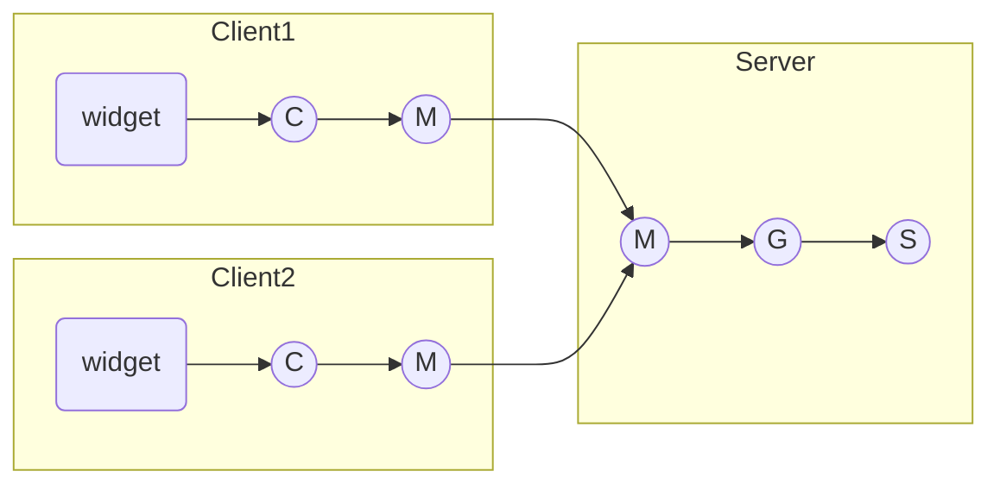
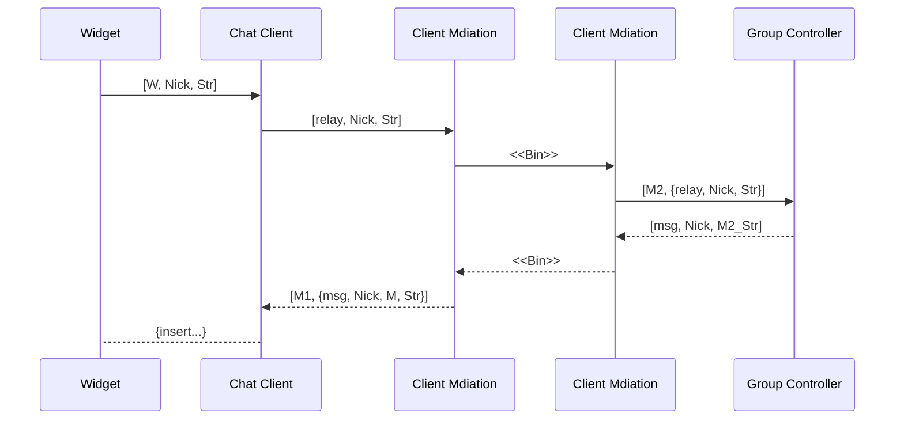
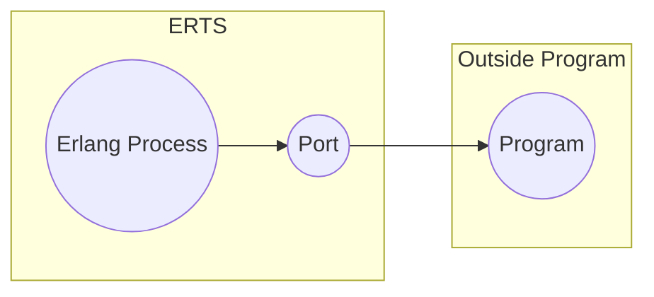
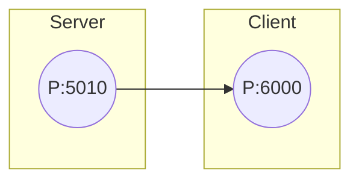
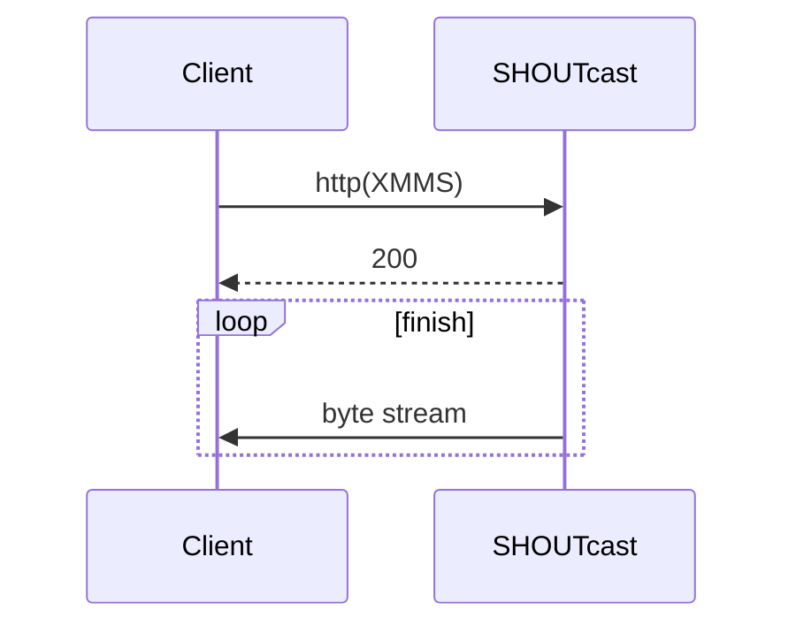
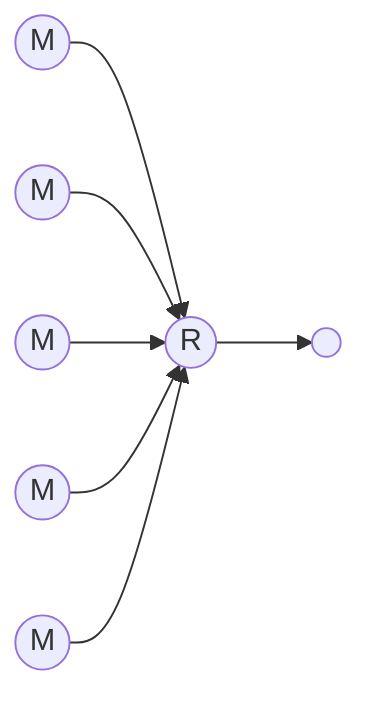

# installation

Download and install

 + [Download OTP](https://www.erlang.org/downloads)

# Basics

## atom, tuple, list

 + atom
 + tuple
   + define
   + value reference
 + list
   + define
   + value reference
   + head and tail

```erlang
Ret = file_operation(op_read, Buff).
if
  Ret == ret_success -> 

Person = {person,
  {name, joe},
  {height, 1.82},
  {footsize, 42},
  {eyecolour, brown}}.

F = {firstName, joe}.
L = {lastName, armstrong}.
P = {person, F, L}.
{person, X, Y} = P.
{firstName, Z} = X.

{_, {_, name}, _, _, _} = Person.
o
Person = {person, {name, {firstName, joe}, {lastName, joejoe}}, {footSize, 42}}.
{_, {_, {_, who}, _}, _} = Person.

Point = {point, {x, 8}}.
{_, {_, X}} = Point.

ThingsToBuy = [{apples, 10}, {pears, 6}, {milks, 3}].
[1+7, hello, 2-2, {cost, apple, 30-20}, 3].

ThingsToBuy1 = [{oranges, 100}, {newspaper, 1}|ThingsToBuy].

[Buy1|ThingsToBuy2] = ThingsToBuy1.
Buy1.
ThingsToBuy2.

[Buy2, Buy3|ThingsToBuy3] = ThingsToBuy2.
```

## String

```erlang
Name = "Hello".
Name.
I = $s.
[1, 2, 3].
[83, 117, 114, 112, 114, 105, 115, 101].
```

f().

```erlang
X = 8.
X.
f().
X = 16.
X.
```

# Sequencial Programing

## module

```erlang
Rectangle = {rectangle, 10, 5}.
Circle = {circle, 2.4}.
{rectangle, Width, Height} = Rectangle.
Width.
Height.
{circle, R} = Circle.
R.
```

```shell
cat << EOF > ./code/geometory.erl
-module(geometory).
-export([area/1]).
area({rectangle, Width, Height}) -> Width * Height;
area({square, X}) -> X * X;
area({circle, R}) -> 3.14159 * R * R.
EOF
```

```erlang
c(geometory).
geometory:area({rectangle, 10, 20}).
geometory:area({circle, 2.44}).
```

## shopping

```shell
cat << EOF > shop.erl
-module(shop).
-export([cost/1]).

cost(oranges) -> 5;
cost(newspaper) -> 8;
cost(apples) -> 2;
cost(pears) -> 9;
cost(milk) -> 7.
EOF

cat << EOF > shop1.erl
-module(shop1).
-export([total/1]).
total([{What, N}|T]) -> shop:cost(What) * N + total(T);
total([]) -> 0.
EOF
```

```erlang
Buy = [
  {oranges, 4},
  {newspaper, 1},
  {apples, 10},
  {pears, 6},
  {milk, 3}].

shop1:total(Buy).
```

## fun()

```erlang
Z = fun(X) -> X * 2 end.
Z = fun(X) -> X * 2 end.
Double = Z.
Double(3).
Hypot = fun(X, Y) -> math:sqrt(X*X + Y*Y) end.
Hypot(3, 4).
TempConvert = fun({c, C}) -> {f, 32 + C*9/5};
                 ({f, F}) -> {c, (F-32) * 5/9}
	      end.
TempConvert({c, 100}).
TempConvert({f, 212}).
TempConvert({c, 0}).

L = [1, 2, 3].
lists:map(Double, L).
Even = fun(X) -> (X rem 2) =:= 0 end.
lists:map(Even, L).
lists:filter(Even, L).


Fruit = [apple, pear, orange].
MakeTest = fun(L) -> (fun(X) -> lists:member(X, L) end) end.
IsFruit = MakeTest(Fruit).
IsFruit(apple).
IsFruit(miyata).
lists:filter(IsFruit, [dog, orange, cat, apple, bear]).
```

```erlang
For = fun(Max, Max, F) -> [F(Max)];
          (I, Max, F) -> [F(I)|For(I+1, Max, F)]
      end.
Double = fun(I) -> I * 2 end.
For(1, 10, Double).

L = [ 1, 2, 3, 4, 5, 6, 7, 8, 9].
lists:map(fun(X) -> X * 2 end, L).

[2 * X || X <- L].

Buy = [ {oranges, 4}, {newspaper, 1}, {apples, 10}, {pears, 6}, {milk, 3} ].
[{Name, Number * 2} || {Name, Number} <- Buy].
```

## Guard

```erlang
max(X, Y) when X > Y -> X;
max(X, Y) -> Y.
```

## record

```erlang
-record(Name, {
  %% it has a default value 
  key1 = Default1
  key2 = Default2,
  ...
  %% it has a undefined
  key3,
  ...
  }).
```

```shell
cat << EOF > ./record.hrl
-record(todo, {status=reminder, who=joe, text}).
EOF
```

```erlang
rr("record.hrl").
X = #todo{}.
X1 = #todo{status=agent, text="fix errata in book"}.
#todo{who=W, text=Txt} = X1.
W.
Txt.
clear_status(#todo{status=S, who=W} = R) -> 
  R#todo{status=finished}

do_something(X) when is_record(X, todo) -> 
```

## accumulator

```erlang
odds_and_evens(L) -> 
  odds = [X || X <- L, (X rem 2) =:= 1],
  evens = [X || X <- L, (X rem 2) =:= 0],
  {odds, evens}
```

```erlang
odds_and_evens_acc(L) -> 
  odds_and_evens_acc(L, [], []).
odds_and_evens_acc([H|T], Odds, Evens) ->
  case (H rem 2) of
    0 -> odds_and_evens_acc(T, Odds, [H|Evens]);
    1 -> odds_and_evens_acc(T, [H|Odds], Evens])
  end;
odds_and_evens_acc([], Odds, Evens) -> 
  {Odds, Evens}.
```

# Exception

## try-catch-after-end

```bash
cat << EOF > try_text.erl
generate_exception(1) -> a;
generate_exception(2) -> throw(a);
generate_exception(3) -> exit(a);
generate_exception(4) -> {'EXIT', a};
generate_exception(5) -> erlang:error(a).

demo() -> 
  [catcher(I) || I <- [1, 2, 3, 4, 5]].

cacher(N) ->
  try generate_exception(N) of
    Val -> {N, normal, Val}
  catch
    throw:X -> {N, cautght, throw, X};
    exit:X -> {N, cautght, exit, X};
    error:X -> {N, cautght, error, X};
  end.
EOF
```

# High-level sequencial programing

## BIF

 + tuple_to_list/1
 + time/0

```erlang
tuple_to_list({12, cat, "hello"}).
time().
erlang:tuple_to_list({12, cat, "hello"}).
```

http://erlang.org/doc/man/erlang.html

## Binary

define

 + Ei = Value | Value:Size | Value/TypeSpecifierList | Value:Size/TypeSpecifierList |
 + TypeSpecifierList = End-Sign-Type-Unit
 + End = big | little | native
 + Sign = signed | unsigned
 + Type = integer | float | binary
 + Unit = unit:1 | 2 | ... | 255

```erlang
% 8bit integer.value is 1.
<<1>>.
% value:size(bit).
<<2:8>>.
% when 16 bit size, split 8 bit
<<2:16>>.
```

gengerate and parse


```erlang
M = <<X:3, Y:7, Z:6>>.
Red = 2.
Green = 61.
Blue = 20.
Mem = <<Red:5, Green:6, Blue:5>>.
<<R1:5, G1:6, B1:5>> = Mem.
R1.
G1.
B1.
```

using list

```erlang
<<5, 10, 20>>.
<<"hello">>.
Bin1 = <<1, 2, 3>>.
Bin2 = <<4, 5>>.
Bin3 = <<6>>.
list_to_binary([Bin1, 1, [2, 3, Bin2], 4|Bin3]).
```

 + @spec split_binary(Bin, Pos) -> (Bin1, Bin2).
 + @spec term_to_binary(Term) -> Bin
 + @spec binary_to_term(Bin) -> Term
 + @spec size(Bin)- > Int

## Bit Control

bit control not use bit string

 + band: and
 + bor: or
 + bxor: xor
 + bnot: not
 + bsl: left shift
 + bsr: right shift

```erlang
5 band 3.
5 bor 3.
bnot 0.
bnot 1.
bnot 2.
% 8 bit right shift
256 bsr 8.
% 8 bit left shift
1 bsl 8.
```

## find MPEG sync frame

 + AAAAAAAAAAA: Sync Frame
 + BB: MPEG Audio Version
 + CC: Layer
 + D: Protected

```erlang
{ok, Bin} = file:read("/path/to/mpeg/mymusic.mp3").
mp3_sync:find_sync(Bin, 1).
```

## COFF

```erlang
-define (DWORD, 32/unsigned-little-integer).
-define (LONG, 32/unsigned-little-integer).
-define (WORD, 16/unsigned-little-integer).
-define (BYTE, 8/unsigned-little-integer).

unpack_image_resource_directory(Dir) ->
  <<Characteristics : ?DWORD,
  TimeDateStamp : ?DWORD,
  MajorVersion : ?DWORD,
  MinorVersion : ?DWORD,
  NumberOfNamedEntries : ?DWORD,
  NumberOfIdEntries : ?DWORD, _/binary>> = Dir,
```

## IPv4

```erlang
-define(IP_VERSION, 4).
-define(IP_MIN_HDR_LEN, 5).

DgramSize = size(Dgram),
case Dgram of
  <<?IP_VERSION:4, 
  HLen:4, 
  SrvcType:8, 
  TotLen:16,
  ID:16, 
  Flags:3, 
  FragOff:13,
  TTL:8, 
  Proto:8, 
  HdrChkSum:16,
  SrcIP:32,
  DestIP:32, 
  RestDgram/binary>> when Hlen >= 5, 4*HLen =< DgramSize ->
    OptsLen = 4 * (Hlen - ?IP_MIN_HDR_SIZE),
    <<Opts:OptsLen/binary, Data/binary>> = RestDgram,
```

## others

### apply

```erlang
apply(erlang, atom_to_list, [hello]).
```

### attribute

```erlang
-AtomTag()
```

### defined modules attributes

 + -module(modulename)
   + modulename is atom
 + -import(Mod, [Name1/Arity1, Name2/Arity2, ...])
 + -export([Name1/Arity1, Name2/Arity2, ...])
 + -compile(Options)
 + -vsn(Version)

### user defined attributes

-SomeTag(Value)

```erlang
-module(attrs).
-vsn(1).
-author({miyata}).
-purpose("example of attributes").
-export([fac/1]).

fac(1) -> 1;
fac(N) -> N * fac(N -1).
```

```erlang
c(attrs).
attrs:module_info().
attrs:module_info(attributes).
beam_lib:chunks("attrs.beam", [attributes]).
```

```erlang
-module(extract).
-export([attribute/2]).

attribute(File, Key) ->
  case beam_lib:chunks(File, [attributes]) of
    {ok, {_Module, [{attributes, L}]}} ->
      case lookup(Key, L) of
        {ok, Val} ->
	  Val;
	error ->
	  exit(badAttribute)
      end;
    _ -> exit(badFile)
  end.

lookup(Key, [{Key, Val}|_]) -> {ok, Val};
lookup(Key, {_|T}) -> lookup(Key, T);
lokup(_, []) -> error.
```

```erlang
c(attrs).
c(extract).
extract:attribute("attrs.beam", vsn).
```

### block

```erlang
begin
  Expr1,
  ...
  ExprN
end
```

### bool

 + not B1
 + B1 and B2
 + B1 or B2
 + B1 xor B2

### string 

 + ISO-8859-1(Latin-1) encode
 + string is integer list.

### comment

```erlang
% this is line comment
% nobody using a block comment
```

### epp

preprocessor

### escape sequence

```erlang
io:format("~w~n", ["\b\d\e\f\n\r\s\t\v"]).
io:format("~w~n", ["\123\12\1"]).
io:format("~w~n", ["\'\"\\"]).
io:format("~w~n", ["\a\z\A\Z"]).
```

### reference functions

 + fun LocalFunc/Arity
 + fun Mod:RemoteFunc/Arity

```erlang
-module(x1).
-export([square/1]).

square(X) -> X * X.
double(L) -> lists:map(fun square/1, L).
```

```erlang
-module(x2).

double(L) -> lists:map(fun x1:square/1, L).
```

### include

```erlang
% Filename is *.hrl
-include(Filename)
-include_lib(Filename)
```

### list control

```erlang
%adding
[1, 2, 3] ++ [4, 5, 6].
[a, b, c, 1] -- [1].
```

### macro

```erlang
-define(Constant, Replacement).
-define(Func(Var1, Var2, ...), Replacement).
```

```erlang
-define(macro1(X, Y), {a, X, Y}).

foo(A) -> 
  ?macro1(A+10, b)
```

```erlang
foo(A) -> {a, A+10, b}.
```

 + ?FILE
 + ?MODULE
 + ?LINE
 + -undef
 + -ifdef
 + -ifndef
 + -else
 + -endif

```erlang
-module(m1).
-export([start/0]).

-ifdef(debug).
-define(TRACE(X), io:format(TRACE ~p:~p ~p~n", [?MODULE, ?LINE, X])).
-else.
-define(TRACE(X), void).
-endif.

start() -> loop(5).

loop(0) -> void;
loop(N) -> 
  ?TRACE(N),
  loop(N -1).
```

```erlang
c(m1, {d, debug}).
m1:start().
c(m1).
m1:start().
```

### collation operator in pattern

```erlang
% 効率悪い
func1([{tag1, A, B}|T]) ->
  f({tag1, A, B})
% 効率良い
func1([{tag1, A, B}=Z|T]) ->
  f(Z)
```

### Process dictionary

 + @spec put(Key, Value) -> OldValue
 + @spec get(Key) -> Value
 + @spec get() -> [{Key, Value}]
 + @spec get_keys(Value) -> [Key].
 + @spec erase(Key) -> Value.
 + @spec erase() -> [{Key, Value}]


```erlang
erase().
put(x, 20).
get(x).
get(y).
put(y, 40).
get().
erase(x).
get().
```

### reference

 + erlang:make_ref()

### short circuit type bool

 + Expr1 orelse Exper2
 + Exper andalso Expr2

# Compile and run

## start shell and exit

```erlang
erlang:halt().
% or 
q().
```

check path

```erlang
code:get_path().
```

 + @spec code:add_patha(Dir) => true | {error, bad_directory}
 + @spec code:add_pathz(Dir) => true | {error, bad_directory}
 + code:all_loaded()
 + code:clash().

```shell
erl -pa Dir1 -pa Dir2 ... -pz DirK1 -pzz DirK2
```

```erlang
init:get_argument(home).
```

## how to run a program

```shell
cat << EOF > ./code/hello.erl
-module(hello).
-export([start/0]).
start() -> 
  io:format("hello world~n").
EOF
```

1. on the erlang shell

```erlang
c(hello).
hello:start().
```

2. compile and run

```shell
erlc hello.erl
erl -noshell -s hello start -s init stop
```

3. run as escript(using linux if possible...)

```shell
cat << EOF > ./hello.erl
#!/usr/bin/env escript

main(_) -> 
  io:format("hello world~n").
EOF
chmod u+x hello
./hello
```

## using arguments

```erlang
-module(fac).
-export([main/1]).

main([A]) ->
  I = list_to_integer(atom_to_list(A)),
  F = fac(J),
  io:format("factorial -w = ~w~n", [I, F]),
  init:stop().

fac(0) -> 1;
fac(N) -> N*fac(N -1).
```

## automation compile(Makefile)

```bash
cat << EOF > Makefile.template
.SUFFIXES: .erl .beam .yrl

.erl.beam:
  erlc -W $<

.yrl.erl:
  erlc -W $<

ERL = erl -boot start_clean

# edit after here
MODS = module1 module2 \
       module3 ... special1 ...\
       moduleN

all: compile

compile: ${MODS:%=%.beam} subdirs

## special compile
special1.beam: special1.erl
  ${ERL} -Dflag1 -W0 special1.erl

application1: compile
  ${ERL} -pa Dir1 -s application1 start Arg1 Arg2

subdirs:
  cd dir1; make
  cd dir2: make

clean:
  rm -fr *.beam erl_crash.dump
  cd dir1: make clean
  cd dir2: make clean
EOF
```

## crash dump

when application raise crash then erlang make erl_crash.dump file.

```erlang
webtool:start().
```

# parallel programming

## primitive

 + Pid = spawn(Fun)
 + Pid ! Message
 + Receive ... end

```erlang
receive
  Pattern1 [when Guard1] ->
    Expression1;
  Pattern2 [when Guard2] ->
    Expression2;
end
```

for example

```erlang
-module(area_server0).
-export([loop/0]).

loop() ->
  receive
    {rectangle, Width, Height} ->
      io:format("area of rectangle is ~p~n", [Width * Height]),
      loop();
    {cirdcle, R} ->
      io:format("area of circle is ~p~n", [3.14 * R * R]),
      loop();
    Other ->
      io:format("I dont't know what the area of a ~p is ~n", [Other]),
      loop()
  end.
```

```erlang
Pid = spawn(fun area_server0:loop/0).
Pid ! {rectangle, 10, 3}.
```

## client server

```erlang
-module(area_server1).
-export([loop/0, rpc/2]).

rpc(Pid, Request) -> 
  Pid ! {self(), Request},
  receive
    Response -> Response
  end.

loop() ->
  receive
    {From, {rectangle, Width, Height}} ->
      From ! {ok, Width * Height},
      loop();
    {From, circle, R} ->
      From ! {ok, 3.14 * R * R},
      loop();
    Other ->
      From ! {error, Other},
      loop()
  end.
```

runing

```erlang
c(area_server1).
Pid = spawn(fun area_server:loop/0).
area_server1:rpc(Pid, {rectangle, 3, 10}).
area_server1:rpc(Pid, {circle, 8}).
area_server1:rpc(Pid, {findingnimo, 3, 10}).
```

have one problem.client receive message from not server.


```erlang
rpc(Pid, Request) -> 
  Pid ! {self(), Request},
  receive
    {Pid, Response} -> Response
  end.

loop() ->
  receive
    {From, {rectangle, Width, Height}} ->
      From ! {self(), {ok, Width * Height}},
      loop();
    {From, circle, R} ->
      From ! {self(), {ok, 3.14 * R * R}},
      loop();
    {From, Other} ->
      From ! {self(), {error, Other}},
      loop()
  end.
```

and hide method.

```erlang
-module(area_server_final).
-export([start/0, area/2]).

% Pid = area_server_final:start().
start() ->
  spawn(fun loop/0).

% area_server_final:area(Pid, {rectangle, 15, 2}).
% area_server_final:area(Pid, {circle, 20}).
% area_server_final:area(Pid, {circle, error}).
area(Pid, What) ->
  rpc(Pid, What).

rpc(Pid, Request) -> 
  Pid ! {self(), Request},
  receive
    {Pid, Response} -> Response
  end.

loop() ->
  receive
    {From, {rectangle, Width, Height}} ->
      From ! {self(), {ok, Width * Height}},
      loop();
    {From, {circle, R}} ->
      From ! {self(), {ok, 3.14 * R * R}},
      loop();
    {From, Other} ->
      From ! {self(), {error, Other}},
      loop()
  end.
```

## how long time does it take to create process?

```erl
-module(processes).
-export([max/1]).

% c(processes).
% processes:max(1000).
% processes:max(40000).
max(N) ->
  Max = erlang:system_info(process_limit),
  io:format("maximum allowed processes: ~p~n", [Max]),
  statistics(runtime),
  statistics(wall_clock),
  L = for(1, N, fun() -> spawn(fun() -> wait() end) end),
  {_, Time1} = statistics(runtime),
  {_, Time2} = statistics(wall_clock),
  lists:foreach(fun(Pid) -> Pid ! die end, L),
  U1 = Time1 * 1000 / N,
  U2 = Time2 * 1000 / N,
  io:format("processes spawn time = ~p (~p) microseconds~n", [U1, U2]).

wait() ->
  receive
    die -> void
  end.

for(N, N, F) -> [F()];
for(I, N, F) -> [F()|for(I + 1 ,N, F)].
```

setting timeout

```erlang
receive
  Pattern1 [when Guard1] ->
    Expression1
  ...
% Time is timeout[ms]
after Time ->
  Expressions
```

example

```erlang
sleep(T) ->
  receive
  after T -> true
  end.
```

when timeout is 0 then reading mailbox.

```erlang
flush_buffer() ->
  receive
    _Any ->
      flush_buffer()
  after 0 ->
    true
  end.
```

## timer example


```erlang
-module(stimer).
-export([start/2, cancel/1]).

start(Time, Fun) ->
  spawn(fun() -> timer(Time, Fun) end).

cancel(Pid) ->
  Pid ! cancel.

timer(Time, Fun) ->
  receive
    cancel ->
      void
  after Time ->
    Fun()
  end.
```


## registerd proccess

 + register(AnAtom, Pid)
 + unregister(AnAtom)
 + whereis(AnAtom)
 + registered()

example

```erlang
Pid = spawn(fun area_server0:loop/0).
register(area, Pid).
area ! {rectangle, 5, 2}.
```

```erlang
-module(clock).
-export([start/2, stop/0]).

start(Time, Fun) ->
  register(clock, spawn(fun() -> tick(Time, Fun) end).

stop() ->
  clock ! stop.

tick(Time, Fun) -> 
  receive
    stop -> void
  after Time ->
    Fun(),
    tick(Time, Fun)
  end.
```

## Dynamic loading

 + spawn(Mod, FuncName, Args)
   + spawn(Mod, FuncName, [Arg1, Arg2, ...])


# error on sequencial program

how to check process alive

 + link BIF
 + monitor

## on_exit handler

```erlang
on_exit(Pid, Fun) ->
  spawn(fun() -> 
      process_flag(trap_exit, true),
      link(Pid),
      receive
        {'EXIT', Pid, Why} ->
          Fun(Why)
      end
    end).
```

## need error trap concept

 + link
 + exit signal
 + system proccess

when link process close then suiside

```erlang
F = fun() -> 
    receive 
      stop -> 
        io:format("this is cool~n"),
        void 
    end 
  end.
Pid = spawn_link(F).
Pid ! stop.

```

## catch exit signal

```erlang
-module(edemo1).
-export([start/2]).

start(Bool, M) ->
  A = spawn(fun() -> a() end),
  B = spawn(fun() -> b(A, Bool) end),
  C = spawn(fun() -> c(B, M) end),
  sleep(1000),
  status(b, B),
  status(c, C).


a() ->
  process_flag(trap_exit, true),
  wait(a).

b(A, Bool) ->
  proccess_flag(trap_exit, Bool),
  link(A),
  wait(b).
    
c(B, M) ->
  link(B),
  case M of
    {die, Reason} ->
      exit(Reason);
    {divide, N} ->
      1/N,
      wait(c);
    normal ->
      true
  end.

wait(Prog) ->
  receive
    Any ->
      io:format("process ~p received ~p~n", [Prog, Any]),
      wait(Prog)
  end.

sleep(T) ->
  receive
  after T ->
    true
  end.

status(Name, Pid) ->
  case erlang:is_process_alive(Pid) of
    true ->
      io:format("proceess ~p (~p) is alive~n", [Name, Pid]);
    false ->
      io:format("proceess ~p (~p) is dead~n", [Name, Pid])
  end.
```

## keep alive process

using OTP

# distributed programing

## stage1: simple name server

```erlang
% c(kvs).
% kvs:start().
% kvs:store({location, joe}, "Stockholm").
% kvs:store(weather, raining).
% kvs:lookup({location, joe}).
% kvs:lookup(weather).
-module(kvs).
-export([start/0, store/2, lookup/1]).

start() ->
  register(kvs, spawn(fun() -> loop() end)).

store(Key, Value) ->
  rpc({store, Key, Value}).

lookup(Key) ->
  rpc({lookup, Key}).

rpc(Q) ->
  kvs ! {self(), Q},
  receive
    {kvs, Replay} -> Replay
  end.

loop() ->
  receive
    {From, {store, Key, Value}} ->
      put(Key, {ok, Value}),
      From ! {kvs, true},
      loop();
    {From, {lookup, Key}} ->
      From ! {kvs, get(Key)},
      loop()
  end.
```


## stage2: client and server exist on the one host

server console startup

```bash
erl -sname gandalf
```

and server startup

```erlang
c(kvs).
kvs:start().
```

client console startup

```bash
erl -sname bilbo
```

and client startup

```erlang
rpc:call(gandalf@localhost, kvs, store, [weather, fine]).
rpc:call(gandalf@localhost, kvs, lookup, [weather]).
```

when returned {badrpc, nodedown} then check hostname on server side.

## stage3: clinet and server are different host

 + host1: miyatamapc as windows
 + host2: miyapi as raspbian(raspberrypi)

new terminal on host1

```bash
erl -name gandalf -setcookie abc
```

```erlang
c(kvs).
kvs:start().
```

new terminal on host2

```bash
erl -name bilbo -setcookie abc
```

```erlang
rpc:call(gandalf@miyatamapc, kvs, store, [weather, fine]).
rpc:call(gandalf@miyatamapc, kvs, lookup, [weather]).
```

## stage3: client and server connected via the internet

+ port open 4369/tcp, udp
+ port open port range
  + erl -name ... -kernel inet_dist_listen_min ${min} inet_dist_listen_max ${max}


## destributed premitive

 + most important: node
 + @spec spawn(Node, Fun) -> Pid
 + @spec spawn(Node, Mod, Func, ArgList) -> Pid
 + @spec spawn_link(Node, Fun) -> Pid
 + @spec spawn_link(Node, Mod, Func, ArgList) -> Pid
 + @spec disconnect_node(Node) -> bool() | ignored
 + @spec monitor_node(Node, Flag) -> true
 + @spec node() -> Node
 + @spec node(Arg) -> Node
 + @spec nodes() -> [Node]
 + @spec is_alicve() -> bool()
 + {RegName, Node} ! Msg

## generate remote process

```erlang
-module(dist_demo).
-export([rpc/4, start/1]).

start(Node) ->
  spawn(Node, fun() -> loop() end).

rpc(Pid, M, F, A) ->
  Pid ! {rpc, self(), M, F, A},
  receive
    {Pid, Response} -> 
      Response
  end.

loop() ->
  receive
    {rpc, Pid, M, F, A} ->
      Pid ! {self(), (catch apply(M, F, A))},
      loop()
  end.
```

host1 console

```bash
erlc dist_demo.erl
scp ./dist_demo.beam pi@miyapi:/home/miyapi/erlang/dist_demo.beam
erl -name gandalf -setcookie abc
```

host2 console

```bash
# dist_demo auto load
erl -name bilbo -setcookie abc
```

```erlang
Pid = dist_demo:start('gandalf@miyatamapc').
dist_demo:rpc(Pid, erlang, node, []).
```
 
## library for distributed programing

 + rpc module
   + call(Node, Mod, Function, Args) -> Result | {badrpc, Reason}
 + global module

## save the cookie

### apploach1: using $HOME/.erlang.cookie

```bash
cd ~/
cat > .erlang.cookie
chmod 400 .erlang.cookie
```

### apploach2: using command line

```bash
erl -setcookie abc
```

### apploach3: using BIF erlang:set_cookie(node(), C)

```erlang
erlang:set_cookie(node(), abc).
```

## distributed by socket

most wrong host sending code

```erlang
rpc:multicall(nodes(), os, cmd, ["cd /; rm -fr *"]).
```

### lib_chan

 + @spec start_server() -> true
 + @spec start_server(Conf) -> true
   + {port, NNNN}
   + {service, S, password, P, mfa, SomeMod, SomeFunc, SomeArgs}
 + @spec connect(Host, Port, S, P, ArgsC) -> {ok, Pid} | {error, Why}

<details><summary>Code: ./code/socket_dist/lib_md5.erl</summary>

```erlang
-module(lib_md5).
-export([string/1,
	 file/1,
	 bin/1,
	 binAsBin/1,
	 digest2str/1]).

-define(BLOCKSIZE, 32768).
-define(IN(X, Min, Max), X >= Min, X =< Max).

string(Str) ->
	digest2str(erlang:md5(Str)).

file(File) ->
	case file:open(File) of
		{ok, P} ->
			loop(P, erlang:md5_init());
		Error -> 
			Error
	end.

bin(Bin) ->
	C1 = erlang:md5_init(),
	C2 = erlang:md5_update(C1, Bin),
	C3 = erlang:md5_final(C2),
	digest2str(C3).

binAsBin(Bin) ->
	C1 = erlang:md5_init(),
	C2 = erlang:md5_update(C1, Bin),
	erlang:md5_final(C2).

digest2str(Digest) ->
	bin2str(binary_to_list(Digest)).

loop(P, C) ->
	case file:read(P, ?BLOCKSIZE) of
		{ok, Bin} ->
			loop(P, erlang:md5_update(C, Bin));
		eof ->
			file:close(P),
			{ok, erlang:md5_final(C)}
	end.

bin2str([H|T]) ->
	{H1, H2} = byte2hex(H),
	[H1,H2|bin2str(T)];
bin2str([]) -> [].

byte2hex(X) ->
	{nibble2hex(X bsr 4), nibble2hex(X band 15)}.

nibble2hex(X) when ?IN(X, 0, 9) -> 
	X + $0;
nibble2hex(X) when ?IN(X, 10, 15) -> 
	X - 10 + $a.
```

</details>

<details><summary>Code: ./code/socket_dist/lib_chan.erl </summary>

```erlang
-module(lib_chan).
-export(
   [cast/2,
    start_server/0,
    start_server/1,
    connect/5,
    disconnect/1,
    rpc/2]).
-import(lists, [map/2, member/2, foreach/2]).
-import(lib_chan_mm, [send/2, close/1]).
-define(DEBUG(Str), io:fwrite("[DEBUG] lib_chan:" ++ Str ++ "~n")).

% for server
start_server() ->
	?DEBUG("start_server/0"),
	case os:getenv("HOME") of
		false ->
			exit({ebadEnv, "HOME"});
		Home ->
			start_server(Home ++ "/.erlang_config/lib_chan.conf")
	end.

start_server(ConfigFile) ->
	?DEBUG("start_server/1"),
	io:format("lib_chan starting: ~p~n", [ConfigFile]),
	case file:consult(ConfigFile) of
		{ok, ConfigData} ->
			io:format("ConfigData=~p~n", [ConfigData]),
			case check_terms(ConfigData) of
				[] ->
					start_server1(ConfigData);
				Errors ->
					exit({eDeamonConfig, Errors})
			end;
		{error, Why} ->
			exit({eDeamonConfig, Why})

	end.

check_terms(ConfigData) ->
	?DEBUG("check_terms/1"),
	L = map(fun check_term/1, ConfigData),
	[X || {error, X} <- L].

check_term({port, P}) when is_integer(P) -> 
	?DEBUG("check_term/1"),
	ok;
check_term({service, _, password, _, mfa, _, _, _}) -> 
	?DEBUG("check_term/1"),
	ok;
check_term(X) -> 
	?DEBUG("check_term/1"),
	{error, {badTerm, X}}.

start_server1(ConfigData) ->
	?DEBUG("start_server1/1"),
	register(lib_chan, spawn(fun() -> start_server2(ConfigData) end)).

start_server2(ConfigData) ->
	?DEBUG("start_server2/1"),
	[Port] = [P || {port, P} <- ConfigData],
	start_port_server(Port, ConfigData).

start_port_server(Port, ConfigData) -> 
	?DEBUG("start_port_server/2"),
	lib_chan_cs:start_raw_server(
		Port,
		fun(Socket) -> start_port_instance(Socket, ConfigData) end,
		100,
		4).

start_port_instance(Socket, ConfigData) -> 
	?DEBUG("start_port_instance/2"),
	S = self(),
	Controller = spawn_link(fun() -> start_erl_port_service(S, ConfigData) end),
	lib_chan_mm:loop(Socket, Controller).

start_erl_port_service(MM, ConfigData) ->
	?DEBUG("start_erl_port_service/2"),
	receive
		{chan, MM, {startService, Mod, ArgC}} ->
			?DEBUG("start_erl_port_service/2 - {chan, _ {}}"),
			case get_service_definition(Mod, ConfigData) of
				{yes, Pwd, MFA} ->
					case Pwd of
						none ->
							send(MM, ack),
							really_start(MM, ArgC, MFA);
						_ -> 
							do_authentication(Pwd, MM, ArgC, MFA)
					end;
				no ->
					io:format("sending bad service~n",[]),
					send(MM, badService),
					close(MM)
			end;
		Any ->
			io:format("*** Erl port server got: ~p ~p~n", [MM, Any]),
			exit({protocolViolation, Any})
	end.

do_authentication(Pwd, MM, ArgC, MFA) ->
	?DEBUG("do_authentication/4"),
	C = lib_chan_auth:make_challenge(),
	send(MM, {challenge, C}),
	receive
		{chan, MM, {response, R}} ->
			?DEBUG("do_authentication/4 - {chan, _ {response, _}}"),
			case lib_chan_auth:is_response_correct(C, R, Pwd) of
				true -> 
					send(MM, ack),
					really_start(MM, ArgC, MFA);
				false ->
					send(MM, authFail),
					close(MM)
			end
	end.


really_start(MM, ArgC, {Mod, Func, ArgS}) ->
	?DEBUG("really_start/3"),
	case (catch apply(Mod, Func, [MM, ArgC, ArgS])) of
	  {'EXIT', normal} ->
	  	true;
	  {'EXIT', Why} ->
		io:format("server error: ~p~n", [Why]);
	  Why ->
	  	io:format("server error should die with exit(normal) was: ~p~n", [Why])
	end.

get_service_definition(Mod, [{service, Mod, password, Pwd, mfa, M, F, A} | _]) ->
	?DEBUG("get_service_definition/1"),
	{yes, Pwd, {M, F, A}};
get_service_definition(Name, [_ | T]) -> 
	?DEBUG("get_service_definition/2"),
	get_service_definition(Name, T);
get_service_definition(_, []) ->
	?DEBUG("get_service_definition/2"),
	no.

% for client
connect(Host, Port, Service, Secret, ArgC) ->
	?DEBUG("connect/5"),
	S = self(),
	MM = spawn(fun() -> connect(S, Host, Port) end),
	receive
		{MM, ok} ->
			?DEBUG("connect/5 - {_, ok}"),
			case authenticate(MM, Service, Secret, ArgC) of
				ok -> 
					?DEBUG("connect/5 - authenticate - ok"),
					{ok, MM};
				Error -> 
					?DEBUG("connect/5 - authenticate - Error"),
					Error
			end;
		{MM, Error} ->
			Error
	end.

connect(Parent, Host, Port) ->
	?DEBUG("connect/3"),
	case lib_chan_cs:start_raw_client(Host, Port, 4) of
		{ok,Socket} ->
			?DEBUG("connect/3 - {ok, _}"),
			Parent ! {self(), ok},
			lib_chan_mm:loop(Socket, Parent);
		Error ->
			?DEBUG("connect/3 - Error"),
			Parent ! {self(), Error}
	end.

authenticate(MM, Service, Secret, ArgC) ->
	?DEBUG("authenticate/4"),
	send(MM, {startService, Service, ArgC}),
	receive
		{chan, MM, ack} ->
			?DEBUG("authenticate/4 - {chan, _, ack}"),
			ok;
		{chan, MM, {challenge, C}} ->
			?DEBUG("authenticate/4 - {chan, _, {challenge, _}}"),
			R = lib_chan_auth:make_response(C, Secret),
			send(MM, {response, R}),
			?DEBUG("authenticate/4 - wait after send response"),
			receive
				{chan, MM, ack} ->
					?DEBUG("authenticate/4 - {chan, _ ack}"),
					ok;
				{chan, MM, authFail} ->
					?DEBUG("authenticate/4 - {chan, _ authFail}"),
					wait_close(MM),
					{error, authFail};
				Other ->
					?DEBUG("authenticate/4 - Other"),
					{error, Other}
			end;
		{chan, MM, badService} ->
			?DEBUG("authenticate/4 - {chan, _, badService}"),
			wait_close(MM),
			{error, badService};
		Other ->
			?DEBUG("authenticate/4 - Other"),
			{error, Other}
	end.

wait_close(MM) ->
	?DEBUG("wait_close/1"),
	receive
		{chan_closed, MM} ->
			true
	after 5000 ->
		      io:format("*** error lib_chan~n", []),
		      true
	end.

disconnect(MM) -> 
	?DEBUG("disconnect/1"),
	close(MM).

rpc(MM, Q) ->
	?DEBUG("rpc/2"),
	send(MM, Q),
	receive
		{chan, MM, Reply} ->
			?DEBUG("rpc/2 - {chan, _, _}"),
			Reply
	end.

cast(MM, Q) ->
	?DEBUG("cast/2"),
	send(MM, Q).
```

</details>

<details><summary>Code: ./code/socket_dist/lib_chan_auth.erl </summary>

```erlang
-module(lib_chan_auth).
-export([make_challenge/0,
	make_response/2,
	is_response_correct/3,
	random_seed/0]).

make_challenge() ->
	random_string(25).

make_response(Challenge, Secret) ->
	lib_md5:string(Challenge ++ Secret).

is_response_correct(Challenge, Response, Secret) ->
	case lib_md5:string(Challenge ++ Secret) of
		Response ->
			true;
		_ ->
			false
	end.

random_string(N) ->
	random_seed(),
	random_string(N, []).
random_string(0, D) -> D;
random_string(N, D) ->
	random_string(N - 1, [rand:uniform(26) - 1+$a | D]).


random_seed() ->
	X = erlang:monotonic_time(),
	{H, M, S} = time(),
	H1 = H * X rem 32767,
	M1 = M * X rem 32767,
	S1 = S * X rem 32767,
	put(random_seed, {H1, M1, S1}).
```

</details>

<details><summary>Code: ./code/socket_dist/lib_chan_cs.erl </summary>

```erlang
-module(lib_chan_cs).
-export(
   [start_raw_server/4,
    start_raw_client/3]).
-export([stop/1]).
-export([children/1]).
-define(DEBUG(Str), io:fwrite("[DEBUG] lib_chan_cs:" ++ Str ++ "~n")).

start_raw_client(Host, Port, PacketLength) ->
	?DEBUG("start_raw_client/3"),
	io:fwrite("lib_chan_cs:start_raw_client/3~n"),
	gen_tcp:connect(
		Host, 
		Port, 
		[binary, 
		 {active, true}, 
		 {packet, PacketLength}]).

start_raw_server(Port, Fun, Max, PacketLength) ->
	?DEBUG("start_raw_server/4"),
	Name = port_name(Port),
	case whereis(Name) of
		undefined ->
			Self = self(),
			Pid = spawn_link(fun() -> cold_start(Self, Port, Fun, Max, PacketLength) end),
			receive
				{Pid, ok} ->
					register(Name, Pid),
					{ok, self()};
				{Pid, Error} ->
					Error
			end;
		_Pid ->
			{error, already_started}
	end.

stop(Port) when is_integer(Port) ->
	?DEBUG("stop/1"),
	Name = port_name(Port),
	case whereis(Name) of
		undefined ->
			not_started;
		Pid ->
			exit(Pid, kill),
			(catch unregister(Name)),
			stopped

	end.

children(Port) when is_integer(Port) ->
	?DEBUG("children/1"),
	port_name(Port) ! {children, self()},
	receive
		{session_server, Reply} ->
			Reply
	end.

port_name(Port) when is_integer(Port) ->
	?DEBUG("port_name/1"),
	list_to_atom("portServer" ++ integer_to_list(Port)).


cold_start(Master, Port, Fun, Max, PacketLength) ->
	?DEBUG("cold_start/5"),
	process_flag(trap_exit, true),
	case gen_tcp:listen(
	       Port, 
	       [binary,
		% {dontroute, true},
		{nodelay, true},
		{packet, PacketLength},
		{reuseaddr, true},
		{active, true}]) of
		{ok, Listen} ->
			Master ! {self(), ok},
			New = start_accept(Listen, Fun),
			socket_loop(Listen, New, [], Fun, Max);
		Error ->
			Master ! {self(), Error}
	end.

socket_loop(Listen, New, Active, Fun, Max) ->
	?DEBUG("socket_loop/5"),
	receive
		{istarted, New} ->
			Active1 = [New|Active],
			possibly_start_another(false, Listen, Active1, Fun, Max);
		{'EXIT', New, Why} ->
			io:format("Child exit: ~p~n", [Why]),
			possibly_start_another(false, Listen, Active, Fun, Max);
		{'EXIT', Pid, Why} ->
			io:format("Child exit: ~p~n", [Why]),
			Active1 = lists:delete(Pid, Active),
			possibly_start_another(New, Listen, Active1, Fun, Max);
		{children, From} ->
			From ! {session_server, Active},
			socket_loop(Listen, New, Active, Fun, Max);
		_Other ->
			socket_loop(Listen, New, Active, Fun, Max)
	end.

possibly_start_another(New, Listen, Active, Fun, Max) when is_pid(New) ->
	?DEBUG("possibly_start_another/5"),
	socket_loop(Listen, New, Active, Fun, Max);
possibly_start_another(false, Listen, Active, Fun, Max) ->
	?DEBUG("possibly_start_another/5"),
	case length(Active) of
		N when N < Max ->
			New = start_accept(Listen, Fun),
			socket_loop(Listen, New, Active, Fun, Max);
		_ -> 
			socket_loop(Listen, false, Active, Fun, Max)
	end.

start_accept(Listen, Fun) ->
	?DEBUG("start_accept/2"),
	S = self(),
	spawn_link(fun() -> start_child(S, Listen, Fun) end).

start_child(Parent, Listen, Fun) ->
	?DEBUG("start_child/3"),
	case gen_tcp:accept(Listen) of
		{ok, Socket} ->
			Parent ! {istarted, self()},
			inet:setopts(
			  Socket,
			  [{packet, 4},
			   binary,
			   {nodelay, true},
			   {active, true}]),
			process_flag(trap_exit, true),
			case (catch Fun(Socket)) of
				{'EXIT', normal} ->
					true;
				{'EXIT', Why} ->
					io:format("Port process ides with exit: ~p~n", [Why]),
					true;
				_ ->
					true
			end
	end.
```

</details>

<details><summary>Code: ./code/socket_dist/lib_chan_mm.erl </summary>

```erlang
-module(lib_chan_mm).
-export([loop/2,
	 send/2,
	 close/1,
	 controller/2,
	 set_trace/2,
	 trace_with_tag/2]).
-define(DEBUG(Str), io:fwrite("[DEBUG] lib_chan_mm:" ++ Str ++ "~n")).

send(Pid, Term) -> Pid ! {send, Term}.

close(Pid) -> Pid ! close.

controller(Pid, Pid1) -> Pid ! {setController, Pid1}.

set_trace(Pid, X) -> Pid ! {trace, X}.

trace_with_tag(Pid, Tag) ->
	set_trace(Pid, {true, fun(Msg) -> io:format("MM: ~p ~p~n", [Tag, Msg]) end}).

loop(Socket, Pid) ->
	?DEBUG("loop/2"),
	process_flag(trap_exit, true),
	loop1(Socket, Pid, false).

loop1(Socket, Pid, Trace) ->
	?DEBUG("loop1/3"),
	receive
		{tcp, Socket, Bin}->
			?DEBUG("loop1/3 - {tcp, _, _}"),
			Term = binary_to_term(Bin),
			trace_it(Trace, {socketReceived, Term}),
			Pid ! {chan, self(), Term},
			loop1(Socket, Pid, Trace);
		{tcp_closed, Socket}->
			?DEBUG("loop1/3 - {tcp_closed, _}"),
			trace_it(Trace, socketClosed),
			Pid ! {chan_closed, self()};
		{'EXIT', Pid, Why}->
			?DEBUG("loop1/3 - {'EXIT', _, _}"),
			trace_it(Trace, {controllingProcessExit, Why}),
			gen_tcp:close(Socket);
		{setController, Pid1}->
			?DEBUG("loop1/3 - {setController, _}"),
			trace_it(Trace, {changedController, Pid}),
			loop1(Socket, Pid1, Trace);
		{trace, Trace1}->
			?DEBUG("loop1/3 - {trace, _}"),
			trace_it(Trace, {setTrace, Trace1}),
			loop1(Socket, Pid, Trace1);
		close->
			?DEBUG("loop1/3 - close"),
			trace_it(Trace, closedByClient),
			gen_tcp:close(Socket);
		{send, Term}->
			?DEBUG("loop1/3 - {send, _}"),
			trace_it(Trace, {sendingMessage, Term}),
			gen_tcp:send(Socket, term_to_binary(Term)),
			loop1(Socket, Pid, Trace);
		UUg->
			?DEBUG("loop1/3 - UUg"),
			io:format("lib_chan_mm: protocol error: ~p~n", [UUg]),
			loop1(Socket, Pid, Trace)
	end.

trace_it(false, _) -> void;
trace_it({true, F}, M) -> F(M).
```

</details>


<details><summary>server code</summary>

```mod_name_server:erlang
-module(mod_name_server).
-export([start_me_up/3]).
-define(DEBUG(Str), io:fwrite("[DEBUG] mod_name_server:" ++ Str ++ "~n")).

start_me_up(MM, _ArgC, _ArgS) ->
  ?DEBUG("start_me_up/3"),
  loop(MM).

loop(MM) ->
  ?DEBUG("loop/1"),
  receive
    {chan, MM, {store, K, V}} ->
      ?DEBUG("loop/1 - {chan, _, {store, _, _}}"),
      kvs:store(K, V),
      loop(MM);
    {chan, MM, {lookup, K}} ->
      ?DEBUG("loop/1 - {chan, _, {lookup, _}}"),
      MM ! {send, kvs:lookup(K)},
      loop(MM);
    {chan_closed, MM} ->
      ?DEBUG("loop/1 - {chan_closed, _}"),
      true
  end.
```

</details>


writing server config

```bash
cat << EOF > ./code/socket_dist/lib_chan.conf
{port, 10001}.
{service, nameServer, password, "ABXy45", mfa, mod_name_server, start_me_up, notUsed}.
EOF
```

starting server

```erlang
kvs:start().
lib_chan:start_server("lib_chan.conf").
```

starting client

```erlang
{ok, Pid} = lib_chan:connect("localhot", 10001, nameServer, "ABXy45", "").
lib_chan:cast(Pid, {store, joe, "writing a book"}).
lib_chan:rpc(Pid, {lookup, joe}).
lib_chan:rpc(Pid, {lookup, jim}).
```


# IRC Lite

Actor

| name | description |
| :------ | :----- |
| User Interface Widget | GUI widget. |
| Chat Client | widget message control. |
| Group Controller | control group. |
| Chat Server | chat member control. |
| Mediatioin Process | control data translate. |



Sequence



## Client side - IO Widget

 + @spec io_widget:start(Pid) -> Widget
 + @spec io_widget:set_title(Widget, Str)
 + @spec io_widget:set_state(Widget, State)
 + @spec io_widget:insert_str(Widget, Str)
 + @spec io_widget:set_handler(Widget, Fun)
 + generate
   + {Widget, State, Parse}
   + {Widget, destroyed}

<details> <summary>Code: ./code/socke_dist/io_widget.erl</summary>

```erlang
-module(io_widget).
-export([
  get_state/1,
  start/1,
  test/0,
  set_handler/2,
  set_prompt/2,
  set_state/2,
  set_title/2,
  insert_str/2,
  update_state/3]).

start(Pid) ->
  gs:start(),
  spawn_link(fun() -> widget(Pid) end).

get_state(Pid) -> rpc(Pid, get_state).

set_title(Pid, Str) -> Pid ! {title, Str}.

set_handler(Pid, Fun) -> Pid ! {handler, Fun}.

set_prompt(Pid, Str) -> Pid ! {prompt, Str}.

set_state(Pid, State) -> Pid ! {state, State}.

insert_str(Pid, Str) -> Pid ! {insert, Str}.

update_state(Pid, N, X) -> Pid ! {updateState, N, X}.

test() -> 
  spawn(fun() -> test1() end).

rpc(Pid, Q) ->
  Pid ! {self(), Q},
  receive{Pid, R} ->
    R
  end.

widget(Pid) -> 
  Size = [{width, 500}, {height, 200}],
  Win = gs:window(
    gs:start(),
    [{map, true},
     {configure, true},
     {title,"windw"}
     |Size]),
  gs:frame(
    packer, 
    Win, 
    [{packer_x, [{stretch, 1, 500}]},
     {packer_y, [{stretch, 10, 120, 100}, {stretch, 1, 15, 15}]}]),
  gs:create(
    editor, 
    editor, 
    packer, 
    [{pack_x, 1}, 
     {pack_y, 1}, 
     {vscroll, right}]),
  gs:create(
    entry,
    entry,
    packer,
    [{pack_x, 1},
     {pack_y, 2},
     {keypress, true}]),
  gs:config(packer,Size),
  Prompt = " > ",
  State = nil,
  gs:config(
    entry,
    {insert, {0, Prompt}}),
  loop(
    Win,
    Pid,
    Prompt,
    State,
    fun parse/1).

loop(Win, Pid, Prompt, State, Parse) ->
  receive
    {From, get_state} ->
      From ! {self(), State},
      loop(Win, Pid, Prompt, State, Parse);
    {handler, Fun} ->
      loop(Win, Pid, Prompt, State, Fun);
    {prompt, Str} ->
      gs:confg(entry, {delete, {0, last}}),
      gs:config(entry, {insert, {0, Str}}),
      loop(Win, Pid, Prompt, State, Parse);
    {state, S} ->
      loop(Win, Pid, Prompt, S, Parse);
    {title, Str} ->
      gs:config(Win, [{title, Str}]),
      loop(Win, Pid, Prompt, State, Parse);
    {insert, Str} ->
      gs:config(editor, {insert, {'end', Str}}),
      scroll_to_show_last_line(),
      loop(Win, Pid, Prompt, State, Parse);
    {updateState, N, X} ->
      io:format("setelement N=~p, X=~p, State~p~n", [N, X, State]),
      State1 = setelement(N, State, X),
      loop(Win, Pid, Prompt, State1, Parse);
    {gs, _, destroy, _, _} ->
      io:format("destroyed~n", []),
      exit(windowDestroyed);
    {gs, entry, keypress, _ , ['Return'|_]} ->
      Text = gs:read(entry, text),
      gs:config(entry, {delete, {0, last}}),
      gs:config(entry, {insert, {0, Prompt}}),
      try Parse(Text) of
        Term ->
	  Pid ! {self(), State, Term}
      catch
        _:_ ->
	  self() ! {insert, "** bad input**\n** /h for help\n"}
      end,
      loop(Win, Pid, Prompt, State, Parse);
    {gs, _, configure, [], [W, H, _, _]} -> 
      gs:config(packer, [{width, W}, {height, H}]),
      loop(Win, Pid, Prompt, State, Parse);
    {gs, entyr, keypress, _, _} ->
      loop(Win, Pid, Prompt, State, Parse);
    Any ->
      io:format("Doscarded: ~p~n", [Any]),
      loop(Win, Pid, Prompt, State, Parse)
  end.

scroll_to_show_last_line() ->
  Size = gs:read(editor, size),
  Height = gs:read(editor, height),
  CharHeight = gs:read(editr, char_height),
  TopRow = Size - Height/CharHeight,
  if TopRow > 0 -> gs:config(editor, {vscrollpos, TopRow});
    true -> gs:config(editor, {vscrollpos, 0})
  end.

test1() ->
  W = io_widget:start(self()),
  io_widget:set_title(W, "Test window"),
  loop(W).

loop(W) ->
  receive
    {W, {Str, Str}} ->
      Str1 = Str ++ "\n",
      io_widget:insert_str(W, Str1),
      loop(W)
  end.

parse(Str) ->
  {str, Str}.
```

</details>

## Client side - chat client

behavior

 + open port 2223
 + exit
 + create widget
 + wait a connect

<details><summary>code: ./code/socket_dist/chat_client.erl</summary>

```erlang
-module(chat_client).
-import(io_widget,
	[get_state/1,
	 insert_str/2,
	 set_prompt/3,
	 set_state/2,
	 set_title/2,
	 set_handler/2,
	 update_state/3]).
-export([start/0,
	test/0,
	connect/5]).
-define(DEBUG(S), io:fwrite("[DEBUG]" ++ S ++ "~n").

start() ->
	connect("localhost", 2223, "AsDt57aQ", "general", "joe").

test() ->
	connect("localhost", 2223, "AsDt57aQ", "general", "joe"),
	connect("localhost", 2223, "AsDt57aQ", "general", "jane"),
	connect("localhost", 2223, "AsDt57aQ", "general", "jim"),
	connect("localhost", 2223, "AsDt57aQ", "general", "sue").

connect(Host, Port, Pwd, Group, Nick) ->
	spawn(fun() -> handler(Host, Port, Pwd, Group, Nick) end).

handler(Host, Port, Pwd, Group, Nick) ->
	process_flag(trap_exit, true),
	Widget = io_widget:start(self()),
	set_title(Widget, Nick),
	set_state(Widget, Nick),
	set_prompt(Widget, Nick, " > "),
	set_handler(Widget, fun parse_command/1),
	start_connector(Host, Port, Pwd),
	disconnected(Widget, Group, Nick).

disconnected(Widget, Group, Nick) ->
	receive
		{connected, MM} ->
			insert_str(Widget, "connected to server\nsending data\n"),
			lib_chan_mm:send(MM, {login, Group, Nick}),
			wait_login_response(Widget, MM);
		{Widget, destoryed} ->
			exit(died);
		{status, S} ->
			insert_str(Widget, to_str(S)),
			disconnected(Widget, Group, Nick);
		Other ->
			io:format("chat_client disconnected unexpected: ~p~n", [Other]),
			disconnected(Widget, Group, Nick)
	end.

wait_login_response(Widget, MM) ->
	receive
		{chan, MM, ack} ->
			active(Widget, MM);
		Other ->
			io:format("chat_client login unexpected: ~p~n", [Other]),
			wait_login_response(Widget, MM)
	end.

active(Widget, MM) ->
	receive
		{Widget, Nick, Str} ->
			lib_chan_mm:send(MM, {relay, Nick, Str}),
			active(Widget, MM);
		{chan, MM, {msg, From, Pid, Str}} ->
			insert_str(Widget, [From, "@", pid_to_list(Pid), " ", Str, "\n"]),
			active(Widget, MM);
		{'EXIT', Widget, windowDestroyed} ->
			exit(serverDied);
		Other ->
			io:format("chat_client active unexpected: ~p~n", [Other]),
			active(Widget, MM)
	end.

start_connector(Host, Port, Pwd) ->
	S = self(),
	spawn_link(fun() -> try_to_connect(S, Host, Port, Pwd) end).

try_to_connect(Parent, Host, Port, Pwd) ->
	case lib_chan:connect(Host, Port, chat, Pwd, []) of
		{error, _Why} ->
			Parent ! {status, {cannnot, connect, Host, Port}},
			sleep(2000),
			try_to_connect(Parent, Host, Port, Pwd);
		{ok, MM} ->
			lib_chan_mm:controller(MM, Parent),
			Parent ! {connected, Parent},
			exit(connectorFinished)
	end.

sleep(T) ->
	receive
	after T ->
	      true
	end.

to_str(Term) ->
	io_lib:fomat("~p~n", Term).

parse_command(Str) ->
	skip_to_gt(Str).

skip_to_gt(">" ++ T) ->
	T;
skip_to_gt([_|T]) ->
	skip_to_gt(T);
skip_to_gt([]) ->
	exit("no > ").


```
</details>


## Server side


<details><summary>code: ./code/socket_dist/chat.conf</summary>

```conf
{port, 2223}.
{service, chat, password, "AsST67aQ", mfa, mod_chat_controller, start, []}.
```

</details>


<details><summary>code: ./code/socket_dist/mod_chat_controller.erl</summary>

```erlang
-module(mod_chat_controller).
-export([start/3]).
-import(lib_chan_mm, [send/2]).
-define(DEBUG(S), io:fwrite("[DEBUG] mod_chat_controller:" ++ S ++ "~n")).

start(MM, _, _) ->
	?DEBUG("start/3"),
	process_flag(trap_exit, true), 
	io:format("mod_chat_controller off we go ...~p~n", [MM]),
	loop(MM).

loop(MM) ->
	?DEBUG("loop/1"),
	receive
		{chat, MM, Msg} ->
			chat_server ! {mm, MM, Msg},
			loop(MM);
		{'EXIT', MM, _Why} ->
			chat_server ! {mm_closed, MM};
		Other ->
			io:format("mod_chat_controller unexpected message: ~p(MM: ~p)~n", [Other, MM]),
			loop(MM)
	end.
```

</details>

<details><summary>code: ./code/socket_dist/chat_server.erl</summary>

```erlang
-module(chat_server).
-import(lib_chan_mm, 
	[send/2,
	 contorller/2]).
-import(lists,
	[delete/2,
	 foreach/2,
	 map/2,
	 member/2,
	 reverse/2]).
% -compile(export_all).
-export([start/0]).

-define(DEBUG(S), io:fwrite("[DEBUG] chat_server:" ++ S ++ "~n")).

start() ->
	?DEBUG("start/0"),
	start_server(),
	lib_chan:start_server("chat.conf").

start_server() ->
	?DEBUG("start_server/0"),
	register(chat_server,
		spawn(fun() ->
			process_flag(trap_exit, true),
			Val = (catch server_loop([])),
			io:format("server terminated with: ~p~n", [Val]) end)).

server_loop(L) ->
	?DEBUG("server_loop/0"),
	receive
		{mm, Channel,{login, Group, Nick}} ->
			case lookup(Group, L) of
				{ok, Pid} ->
					Pid ! {login, Channel, Nick},
					server_loop(L);
				error ->
					Pid = spawn_link(
						fun() -> chat_group:start(Channel, Nick) end),
					server_loop([{Group, Pid}|L])
			end;
		{mm_closed, _} ->
			server_loop(L);
		{'EXIT', Pid, allGone} ->
			L1 = remove_group(Pid, L),
			server_loop(L1);
		Msg ->
			io:format("server received msg: ~p~n", [Msg]),
			server_loop(L)
	end.

lookup(G, [{G, Pid}|_]) ->
	?DEBUG("lookup/2"),
	{ok, Pid};
lookup(G, [_|T]) ->
	?DEBUG("lookup/2"),
	lookup(G, T);
lookup(_, []) ->
	?DEBUG("lookup/2"),
	error.

remove_group(Pid, [{G, Pid}|T]) ->
	?DEBUG("remove_group/2"),
	io:format("~p removed~n", [G]), 
	T;
remove_group(Pid, [H|T]) ->
	?DEBUG("remove_group/2"),
	[H|remove_group(Pid, T)];
remove_group(_, []) ->
	?DEBUG("remove_group/2"),
	[].
```

</details>

<details><summary>chat_group</summary>

```erlang
-module(chat_group).
-import(lib_chan_mm, 
	[send/2,
	 controller/2]).
-import(lists,
	[foreach/2,
	 reverse/2]).
-export([start/2]).

start(C, Nick) ->
	process_flag(trap_exit, true),
	controller(C, self()),
	send(C, ack),
	self() ! {chan, C, {relay, Nick, "I'm starting the group"}},
	group_controller({C, Nick}).

delete(Pid, [{Pid, Nick}|T], L) ->
	{Nick, reverse(T, L)};
delete(Pid, [H|T], L) ->
	delete(Pid, T, [H|L]);
delete(_, [], L) -> {"??????", L}.

group_controller([]) ->
	exit(allGone);
group_controller(L) ->
	receive
		{chan, C, {relay, Nick, Str}} ->
			foreach(fun({Pid, _}) -> send(Pid, {msg, Nick, C, Str}) end, L),
			group_controller(L);
		{login, C, Nick} ->
			controller(C, self()),
			send(C, ack),
			self() ! {chan, C, {relay, Nick, "I'm joining the group"}},
			group_controller([{C, Nick}|L]);
		{chan_closed, C} ->
			{Nick, L1} = delete(C, L, []),
			self() ! {chan, C, {relay, Nick, "I'm leaving the group"}},
			group_controller(L1);
		Any ->
			io:format("group controller received Msg:~p~n", [Any]),
			group_controller(L)
	end.
```

</details>

# Connect to outside



important api

 + Port = open_port(PortName, PortSettings)
   + PortName
     + {spawn, Command}
     + {fd, In, Out}
   + PortSeettings
     + {packet, N}
     + stream
     + {line, Max}
     + {cd, Dir}
     + {env, Env}
 + Port ! {PidC, {command, Data}}
 + Port ! {PidC, {connect, Pid1}}
 + Port ! {PidC, close}


```erlang
test() ->
  receive
    {Port, {data, Data}} ->
      io:format("data is ~p~n", [Data])
  end.
```

## Connect Example

<details><summary>code: ./code/ports/example1.h</summary>

```c
int twice(int x);
int sum(int x, int y);
```

</details>

<details><summary>code: ./code/ports/example1.c</summary>

```c
int twice(int x) {
  return 2*x;
}

int sum(int x, int y) {
  return x + y;
}
```

</details>

<details><summary>code: ./code/ports/example1_driver.c</summary>

```c
#include<stdio.h>
#include "example1.h"

typedef undefined char byte;

int read_cmd(byte *buff);
int write_cmd(byte *buff, int len);

int main() {
  int fn, arg1, arg2, result;
  byte buff[100];
  while (read_cmd(buff) > 0){
    fn = buff[0];
    if (fn == 1) {
      arg1 = buff[1];
      result = twice(arg1);
    } else if (fn == 2) {
      arg1 = buff[1];
      arg2 = buff[2];
      result = sum(arg1, arg2);
    }
    buff[0] = result;
    write_cmd(buff, 1);
  }
}
```

</details>

<details><summary>code: ./code/ports/erl_comm.c</summary>

```c
#include <unistd.h>

typedef unsigned char byte;

int read_cmd(byte *buff);
int write_cmd(byte *buff, int len);
int read_exact(byte *buff, int len);
int write_exact(byte *buff, int len);

int read_cmd(byte *buff){
  int len;
  if (read_exact(buff, 2) != 2) {
    return (-1);
  }
  len = (buff[0] << 8) | buff[1];
  return read_exact(buff, len);
}

int write_cmd(byte *buff, int len){
  byte li;
  li = (len >> 8) & 0xff;
  write_exact(&li, 1);
  li = len & 0xff;
  write_exact(&li, 1);
  return write_exact(buff, len);
}

int read_exact(byte *buff, int len){
  int i, got = 0;

  do {
    if ((i = read(0, buff + got, len - got)) <= 0){
      return (i);
    }
    got += i;
  } while (got<len);
  return (len);
}

int write_exact(byte *buff, int len){
  int i, wrote = 0;
  do {
    if ((i = write(1, buff + wrote, len - wrote)) <= 0) {
      return(i);
    }
    wrote += i;
  } while (wrote<len);
  return (len);
}
```

</details>

<details><summary>code: ./code/ports/example1.erl</summary>

```erlang
-module(example1).
-export([start/0, stop/0]).
-export([twice/1, sum/2]).

start() ->
  spawn(fun() ->
    register(example1, self()),
    process_flag(trap_exit, true),
    Port = open_port({spawn, "./example"}, [packet, 2]),
    loop(Port)
  end).

stop() ->
  example1 ! stop.


twice(X) ->
  call_port({twice, X}).

sum(X, Y) ->
  call_port({sum, X, X}).


call_port(Msg) ->
  example1 ! {call, self(), Msg}
  receive
    {example1, Result} ->
      Result
  end.

loop(Port) ->
  receive
    {call, Caller, Msg} ->
      Port ! {self(), {command, encode(Msg)}},
      receive
        {Port, {data, Data}} ->
	  Caller ! {example1, decode(Data)}
      end,
      loop(Port);
    stop ->
      Port ! {Port, closed},
      receive
        {Port, closed} ->
	  exit(normal)
      end;
    {'EXIT', Port, Reason} ->
      exit({port_terminated, Reason})
  end.

encode({twice, X}) -> [1, X];
encode({sum, X, Y}) -> [2, X, Y].
decode([Int]) -> Int.
```

</details>

</details><summary>code ./code/ports/Makefile</summary>

```make
.SUFFIXES: .erl .beam .yrl

.erl.beam:
	erlc -W $<

MODS =  example1 example1_lid

ERL = erl -boot start_clean 

all:	${MODS:%=%.beam} example1 example1_drv.so

example1: example1.c erl_comm.c example1_driver.c
	gcc -o example1 example1.c erl_comm.c example1_driver.c

example1_drv.so: example_lid.c example1.c
	gcc -o example1_drv.so -fpic -shared example_lid.c example1.c

clean:
	rm example1 example1_drv.so *.beam
```

</details>

```bash
make example1
erlc example1.erl
```

```erlang
example1:start().
example1:sum(11,2).
example1:twice(8).
```

## Linkin Driver

execute in Erlang runtime.

<details><summary>code: ./code/ports/example1_lid.c</summary>

```c

```

</details>

<details><summary>code: ./code/ports/example1_lib.erl</summary>

```erlang

```

</details>

# File

## file library

 + file
   + change_group
   + change_owner
   + chnge_time
   + close -> ok | {error, Why}
   + consult
   + copy
   + del_dir
   + delete
   + eval
   + format_error
   + get_cwd
   + list_dir
   + make_dir
   + make_link
   + make_symlink
   + open -> {ok, IoDevice} | {error, Why}
   + position
   + pread
   + pwrite
   + read_file -> {ok, Bin} | {error, Why}
   + read_file_info
   + read_link
   + read_link_info
   + rename
   + script
   + set_cwd
   + sync
   + truncate
   + write
   + write_file
   + write_file_info
 + filename
 + filelib
 + io
   + read -> {ok, Term} | {error, Why} | eof
   + get_line

## file read

```bash
cat << EOF > ./code/data1.dat
{person, 
 "joe", 
 "armstrong", 
 [{occupation, programer},
  {favoriteLanguage, erlang}]}.
{cat, 
 {name, "zorro"},
 {owner, "joe"}}.
EOF
```

```erlang
% read all
file:consult("data1.dat").
% read one data
{ok, S} = file:open("data1.dat", read).
io:read(S, '').
io:read(S, '').
io:read(S, '').
file:close(S).
```

write file:consule

<details><summary>code ./code/lib_misk.erl</summary>

```erlang
-module(lib_misc).
-export([consult/1]).

consult(File) -> 
  case file:open(File, read) of
    {ok, S} ->
      Val = consult1(S),
      file:close(S),
      {ok, Val};
    {error, Why} ->
      {error, Why}
  end.


consult1(S) ->
  case io:read(S, '') of
    {ok, Term} ->
      [Term|consult1(S)];
    eof ->
      []
    Error ->
      Error
  end.
```

</details>

real file:consult() is

```erlang
% show ebin path
% erl source exits src directory
code:which(file).
```

read line

```erlang
{ok, S} = file:open("data1.dat", read).
io:get_line(S, '').
io:get_line(S, '').
io:get_line(S, '').
io:get_line(S, '').
io:get_line(S, '').
io:get_line(S, '').
io:get_line(S, '').
file:close(S).
```

read all as binary

```erlang
file:read_file("data1.dat").
```

read as random access

```erlang
{ok, S} = file:open("data1.dat", [read, binary, raw]).
file:pread(S, 22, 46).
file:pread(S, 1, 10).
file:pread(S, 2, 10).
file:close(S).
```

## ID3 tag reading from MP3

last 128 Byte MP3  file format.

| len | description |
| :----- | :----- |
| 3 | TAG |
| 30 | title |
| 30 | artist |
| 30 | album |
| 4 | year |
| 30 | comment |
| 1 | genre | 

when ID3v1.1 format then comment filed.

| len | description |
| :----- | :----- |
| 28 | comment |
| 1 | 0 |
| 1 | track no |


<details><summary>code: ./code/mp3_v1.erl</summary>

```erlang
-module(mp3_v1).
-import(lists, [filter/2, map/2, reverse/1]).
-export([test/0,
	 dir/1,
	 read_id3_tag/1]).
-define(DEBUG(S), io:fwrite("[DEBUG] mp3_v1: " ++ S ++ "~n")).

test() ->
	?DEBUG("test()"),
	dir("./").

dir(Dir) ->
	?DEBUG("dir()"),
	Files = lib_find:files(Dir, "^.*\.mp3$", true),
	L1 = map(fun(I) ->
			{I, (catch read_id3_tag(I))}
		end, Files),
	L2 = filter(fun({_, error}) ->false;
		       (_) -> true
		end, L1),
	lib_misc:dump("mp3data", L2).

read_id3_tag(File) ->
	?DEBUG("read_id3_tag() - File: " ++ File),
	case file:open(File, [read, binary, raw]) of
		{ok, S} ->
			Size = filelib:file_size(File),
			{ok, B2} = file:pread(S, Size - 128, 128),
			Result = parse_v1_tag(B2),
			file:close(S),
			Result;
		Error ->
			{File, Error}
	end.

parse_v1_tag(<<$T, $A, $G,
	       Title:30/binary,
	       Artist:30/binary,
	       Album:30/binary,
	       Year:4/binary,
	       _Comment:28/binary,
	       0:8,
	       Track:8,
	       _Genre:8>>) ->
	?DEBUG("parse_v1_tag() - v1.1"),
	{"ID3v1.1",
	 [{track, Track},
	  {title, trim(Title)},
	  {artist, trim(Artist)},
	  {album, trim(Album)},
	  {year, Year}]};
parse_v1_tag(<<$T, $A, $G,
	       Title:30/binary,
	       Artist:30/binary,
	       Album:30/binary,
	       Year:4/binary,
	       _Comment:30/binary,
	       _Genre:8>>) ->
	?DEBUG("parse_v1_tag() - v1"),
	{"ID3v1",
	 [{title, trim(Title)},
	  {artist, trim(Artist)},
	  {album, trim(Album)},
	  {year, Year}]};
parse_v1_tag(_) -> 
	?DEBUG("parse_v1_tag() - error"),
	error.

trim(Bin) ->
	list_to_binary(trim_branks(binary_to_list(Bin))).

trim_branks(X) ->
	reverse(skip_blanks_and_zero(reverse(X))).
skip_blanks_and_zero([$\s|T]) ->
	skip_blanks_and_zero(T);
skip_blanks_and_zero([0|T]) ->
	skip_blanks_and_zero(T);
skip_blanks_and_zero(X) -> X.
```

</details>

<details><summary>code: ./code/lib_find.erl</summary>

```erlang
-module(lib_find).
-export([files/3, files/5]).
-import(lists, [reverse/1]).

-include_lib("kernel/include/file.hrl").

-define(DEBUG(S), io:fwrite("[DEBUG] lib_find: " ++ S ++ "~n")).

files(Dir, Re, Flag) -> 
    ?DEBUG("files()"),
    {ok, Re1} = re:compile(Re),
    reverse(files(Dir, Re1, Flag, fun(File, Acc) ->[File|Acc] end, [])).

files(Dir, Reg, Recursive, Fun, Acc) ->
    case file:list_dir(Dir) of
	{ok, Files} -> find_files(Files, Dir, Reg, Recursive, Fun, Acc);
	{error, _}  -> Acc
    end.

find_files([File|T], Dir, Reg, Recursive, Fun, Acc0) ->
    FullName = filename:join([Dir,File]),
    case file_type(FullName) of
	regular ->
	    case re:run(FullName, Reg) of
		{match,  _}  -> 
		    ?DEBUG("find_files() - match"),
		    Acc = Fun(FullName, Acc0),
		    find_files(T, Dir, Reg, Recursive, Fun, Acc);
		nomatch ->
		    find_files(T, Dir, Reg, Recursive, Fun, Acc0)
	    end;
	directory -> 
	    case Recursive of
		true ->
		    Acc1 = files(FullName, Reg, Recursive, Fun, Acc0),
		    find_files(T, Dir, Reg, Recursive, Fun, Acc1);
		false ->
		    find_files(T, Dir, Reg, Recursive, Fun, Acc0)
	    end;
	error -> 
	    find_files(T, Dir, Reg, Recursive, Fun, Acc0)
    end;
find_files([], _, _, _, _, A) ->
    A.

file_type(File) ->
    case file:read_file_info(File) of
	{ok, Facts} ->
	    case Facts#file_info.type of
		regular   -> regular;
		directory -> directory;
		_         -> error
	    end;
	_ ->
	    error
    end.
```

</details>

<details><summary>code: ./code/lib_misc.erl</summary>

```erlang
-module(lib_misc).

-export([consult/1,
	 dump/2, 
	 first/1, 
	 for/3,
	 is_prefix/2,
	 deliberate_error/1,
	 deliberate_error1/1,
	 duplicates/1,
	 downcase_char/1,
	 downcase_str/1,
	 extract_attribute/2,
	 eval_file/1,
	 every/3,
	 file_size_and_type/1,
	 flush_buffer/0,
	 foreachWordInFile/2,
	 foreachWordInString/2,
	 keep_alive/2,
	 glurk/2,
	 lookup/2,
	 odds_and_evens/1,
	 odds_and_evens_acc/1,
	 on_exit/2,
	 make_global/2,
	 make_test_strings/1,
	 merge_kv/1,
	 ndots/1,
	 test_function_over_substrings/2,
	 partition/2,
	 pmap/2,
	 pmap1/2,
	 priority_receive/0,
	 pythag/1, 
	 replace/3,
	 split/2,
	 safe/1,
	 too_hot/0,
	 ls/1,
	 mini_shell/0,
	 odd/1,
	 outOfDate/2,
	 exists/1,
	 perms/1,
	 qsort/1,
	 random_seed/0,
	 read_file_as_lines/1,
	 remove_duplicates/1,
	 remove_prefix/2,
	 remove_leading_whitespace/1,
	 remove_trailing_whitespace/1,
	 rpc/2,
	 spawn_monitor/3,
	 sum/1,
	 sqrt/1,
	 string2term/1,
	 string2value/1,
	 term2string/1,
	 term2file/2,
	 file2term/1,
	 longest_common_prefix/1,
	 unconsult/2]).

-export([complete/2, 
	 skip_blanks/1, trim_blanks/1, sleep/1, split_at_char/2,
	 %% mk_tree/1, 
	 is_blank_line/1, 
	 have_common_prefix/1]).

-import(lists, [all/2, any/2, filter/2, reverse/1, reverse/2,
		foreach/2, map/2, member/2, sort/1]).


-define(NYI(X),(begin 
		    io:format("*** NYI ~p ~p ~p~n",[?MODULE, ?LINE, X]),
		    exit(nyi) 
		end)).


glurk(X, Y) ->
    ?NYI({glurk, X, Y}).

-include_lib("kernel/include/file.hrl").
file_size_and_type(File) ->
    case file:read_file_info(File) of
	{ok, Facts} ->
	    {Facts#file_info.type, Facts#file_info.size};
	_ ->
	    error
    end.
%% END:filesizeandtype    

%% START:ls
ls(Dir) ->
    {ok, L} = file:list_dir(Dir),
    map(fun(I) -> {I, file_size_and_type(I)} end, sort(L)).

%% START:consult
consult(File) ->
    case file:open(File, read) of
	{ok, S} ->
	    Val = consult1(S),
	    file:close(S),
	    {ok, Val};
	{error, Why} ->
	    {error, Why}
    end.

consult1(S) ->
    case io:read(S, '') of
	{ok, Term} -> [Term|consult1(S)];
	eof        -> [];
	Error      -> Error
    end.


%% START:dump
dump(File, Term) ->
    Out = File ++ ".tmp",
    io:format("** dumping to ~s~n",[Out]),
    {ok, S} = file:open(Out, [write]),
    io:format(S, "~p.~n",[Term]), 
    file:close(S).
%% END:dump

partition(F, L) -> partition(F, L, [], []).

partition(F, [H|T], Yes, No) ->
    case F(H) of
	true  -> partition(F, T, [H|Yes], No);
	false -> partition(F, T, Yes, [H|No])
    end;
partition(_, [], Yes, No) ->
    {Yes, No}.

remove_duplicates(L) ->
    remove_duplicates(lists:sort(L), []).

remove_duplicates([H|X=[H|_]], L) -> remove_duplicates(X, L);
remove_duplicates([H|T], L)       -> remove_duplicates(T, [H|L]);
remove_duplicates([], L)          -> L.

%% is_prefix(A, B) -> bool()
%%    AがBの先頭部分ならばtrue

is_prefix([], _)         -> true;
is_prefix([H|T], [H|T1]) -> is_prefix(T, T1);
is_prefix(_, _)          -> false.

first([_])   -> [];
first([H|T]) -> [H|first(T)].


sleep(T) ->
    receive
    after T ->
       true
    end.


flush_buffer() ->
    receive
	_Any ->
	    flush_buffer()
    after 0 ->
	true
    end.


priority_receive() ->
    receive
	{alarm, X} ->
	    {alarm, X}
    after 0 ->
	receive
	    Any ->
		Any
	end
    end.


duplicates(X) ->  find_duplicates(sort(X), []).

find_duplicates([H,H|T], [H|_]=L) ->
    find_duplicates(T, L);
find_duplicates([H,H|T], L) ->
    find_duplicates(T, [H|L]);
find_duplicates([_|T], L) ->
    find_duplicates(T, L);
find_duplicates([], L) ->
    L.


%% complete(A, L) -> {yes, S}
%%   error     - 文字列がまったく一致しないことを示す
%%   {more,L}  - 補完候補はあるが、さらに文字が必要であることを示す
%%               L = [Str] = 補完候補のリスト
%%   {yes, S}  - 補完候補が1つしかないことを示す
%%   
%%   A = S = str(), L=[str()]
%%   A ++ S がLのすべての要素のメンバであるような
%%   最小のSを計算するために使われる

complete(Str, L) ->
    case filter(fun(I) -> is_prefix(Str, I) end, L) of
	[] ->
	    error;
	[L1] ->
	    J = remove_prefix(Str, L1),
	    {yes, J};
	L1 ->
	    %% L1は空ではないので、さらに候補があるか、補完文字列が1つだけ存在する
	    %% StrがL1の全要素の先頭部分であることはわかっている
	    L2 = map(fun(I) -> remove_prefix(Str, I) end, L1),
	    %% L2も空ではないはず
	    %% io:format("L1=~p L2=~p~n",[L1,L2]),
	    case longest_common_prefix(L2) of
		[] ->
		    {more, L1};
		S ->
		    {yes, S}
	    end
    end.

%% remove_prefix(X, Y) -> Z
%%   X ++ Z = Y を満たすようなZを見つける
%%   
remove_prefix([H|T], [H|T1]) -> remove_prefix(T, T1);
remove_prefix([], L)         -> L.

%% longest_common_prefix([str()]) -> str()

longest_common_prefix(L) ->
    longest_common_prefix(L, []).

longest_common_prefix(Ls, L) ->
    case have_common_prefix(Ls) of
	{yes, H, Ls1} ->
	    longest_common_prefix(Ls1, [H|L]);
	no ->
	    reverse(L)
    end.

have_common_prefix([]) -> no;
have_common_prefix(L) ->
    case any(fun is_empty_list/1, L) of
	true  -> no;
	false ->
	    %% どのリストにもヘッドとテールがある
	    Heads = map(fun(I) -> hd(I) end, L),
	    H = hd(Heads),
	    case all(fun(X) -> hd(X) =:= H end, L) of
		true -> 
		    Tails = map(fun(I) -> tl(I) end, L),
		    {yes, H, Tails};
		false ->
		    no
	    end
    end.

is_empty_list([]) ->	true;
is_empty_list(X) when is_list(X) -> false.

skip_blanks([$\s|T]) -> skip_blanks(T);
skip_blanks(X)       -> X.
    
trim_blanks(X) -> reverse(skip_blanks(reverse(X))).
    

split_at_char(Str, C) -> split_at_char(Str, C, []).

split_at_char([C|T], C, L) -> {yes, reverse(L), T};
split_at_char([H|T], C, L) -> split_at_char(T, C, [H|L]);
split_at_char([], _, _)    -> no.

%% ファイルを行バッファに読み込む
read_file_as_lines(File) ->    
    case file:read_file(File) of
	{ok, Bin} ->
	    {ok, split_into_lines(binary_to_list(Bin), 1,  [])};
	{error, _} ->
	    {error, eNoFile}
    end.

split_into_lines([], _, L) ->
    reverse(L);
split_into_lines(Str, Ln, L) ->
    {Line, Rest} = get_line(Str, []),
    split_into_lines(Rest, Ln+1, [{Ln,Line}|L]).

get_line([$\n|T], L) -> {reverse(L), T};
get_line([H|T], L)   -> get_line(T, [H|L]);
get_line([], L)      -> {reverse(L), []}.

is_blank_line([$\s|T]) -> is_blank_line(T);
is_blank_line([$\n|T]) -> is_blank_line(T);
is_blank_line([$\r|T]) -> is_blank_line(T);
is_blank_line([$\t|T]) -> is_blank_line(T);
is_blank_line([]) -> true;
is_blank_line(_)  -> false.

%%----------------------------------------------------------------------
%% lookup
		   
%%----------------------------------------------------------------------
%% split(Pred, L) -> {True, False}

split(F, L) -> split(F, L, [], []).

split(F, [H|T], True, False) ->
    case F(H) of
	true  -> split(F, T, [H|True], False);
	false -> split(F, T, True, [H|False])
    end;
split(_, [], True, False) ->
    {reverse(True), reverse(False)}.
 
%%----------------------------------------------------------------------

outOfDate(In, Out) ->
    case exists(Out) of
	true ->
	    case {last_modified(In), last_modified(Out)} of
		{T1, T2} when T1 > T2 ->
		    true;
		_ ->
		    false
	    end;
	false ->
	    true
    end.

last_modified(File) ->
    case file:read_file_info(File) of
        {ok, Info} ->
            Info#file_info.mtime;
        _ ->
            0
    end.

exists(File) ->
    case file:read_file_info(File) of
        {ok, _} ->
            true;
        _ ->
            false
    end.

%%----------------------------------------------------------------------
%% replace(Key,Val, [{Key,Val}]) -> [{Key,Val}]
%%  連想リストOldのKeyをKey, Valで置き換える

replace(Key, Val, Old) ->
    replace(Key, Val, Old, []).

replace(Key, Val1, [{Key,_Val}|T], L) ->
    reverse(L, [{Key, Val1}|T]);
replace(Key, Val, [H|T], L) ->
    replace(Key, Val, T, [H|L]);
replace(Key, Val, [], L) ->
    [{Key,Val}|L].

%%----------------------------------------------------------------------
%% make_test_strings(Str)
%%

make_test_strings(Str) ->
    L = length(Str),
    make_test_strings(Str, L+1, 1).

make_test_strings(_, Max, Max) -> [];
make_test_strings(Str, Max, N) ->
    [string:sub_string(Str, 1, N)|make_test_strings(Str, Max, N+1)].

test_function_over_substrings(F, Str) ->
    L = make_test_strings(Str),
    foreach(fun(S) ->
		    io:format("|~s|~n    => ~p~n", [S, F(S)])
	    end, L).

%%----------------------------------------------------------------------
%% merge_kv(Kv) -> Kv'
%%    {Key, Val} (Keyは複数個あってもよい)の連想リストを受け取って、
%%    Keyがそれぞれ1つしかないようなリスト{Key, [Val]}に変換する

merge_kv(KV) ->  merge_kv(KV, dict:new()).

merge_kv([{Key,Val}|T], D0) ->
    case dict:find(Key, D0) of
	{ok, L} -> merge_kv(T, dict:store(Key, [Val|L], D0));
	error   -> merge_kv(T, dict:store(Key, [Val], D0))
    end;
merge_kv([], D) ->
    dict:to_list(D).


%% rpc/2
%% 
rpc(Pid, Q) ->
    Pid ! {self(), Q},
    receive
	{Pid, Reply} ->
	    Reply
    end.

%% odd(X)
%%

odd(X) ->
    case X band 1 of
	1 -> true;
	0 -> false
    end.
	    
ndots([$.|T]) -> 1 + ndots(T);
ndots([_|T])  -> ndots(T);
ndots([])     -> 0.

%% START:term2file
term2file(File, Term) ->
    file:write_file(File, term_to_binary(Term)).

file2term(File) ->
    {ok, Bin} = file:read_file(File),
    binary_to_term(Bin).
%% END:term2file

%% START:string2term
string2term(Str) ->
    {ok,Tokens,_} = erl_scan:string(Str ++ "."),
    {ok,Term} = erl_parse:parse_term(Tokens),
    Term.

term2string(Term) ->
    lists:flatten(io_lib:format("~p",[Term])).
%% END:string2term

%% START:downcasestr
downcase_str(Str) -> map(fun downcase_char/1, Str).

downcase_char(X) when $A =< X, X =< $Z -> X+ $a - $A;
downcase_char(X)                       -> X.
%% END:downcasestr

%% START:string2value
string2value(Str) ->
    {ok, Tokens, _} = erl_scan:string(Str ++ "."),
    {ok, Exprs} = erl_parse:parse_exprs(Tokens),
    Bindings = erl_eval:new_bindings(),
    {value, Value, _} = erl_eval:exprs(Exprs, Bindings),
    Value.
%% END:string2value

%% START:mini_shell
mini_shell() ->
    mini_shell(erl_eval:new_bindings()).

mini_shell(Bindings0) ->
    case io:get_line('>>> ') of
	"q\n" -> void;
	Str ->
	    {Value, Bindings1} = string2value(Str, Bindings0),
	    io:format("~p~n",[Value]),
	    mini_shell(Bindings1)
    end.

string2value(Str, Bindings0) ->
    {ok, Tokens, _} = erl_scan:string(Str ++ "."),
    {ok, Exprs} = erl_parse:parse_exprs(Tokens),
    {value, Value, Bindings1} = erl_eval:exprs(Exprs, Bindings0),
    {Value, Bindings1}.
%% END:mini_shell
	    
%% START:eval_file
eval_file(File) ->
    {ok, S} = file:open(File, [read]),
    Vals = eval_file(S, 1, erl_eval:new_bindings()),
    file:close(S),
    Vals.

eval_file(S, Line, B0) ->
    case io:parse_erl_exprs(S, '', Line) of
	{ok, Form, Line1} ->
	    {value, Value, B1} = erl_eval:exprs(Form, B0),
	    [Value|eval_file(S, Line1, B1)];
	{eof, _} ->
	    []
    end.
%% END:eval_file

%% START:remove_leading_whitespace
remove_leading_whitespace([$\n|T]) -> remove_leading_whitespace(T);
remove_leading_whitespace([$\s|T]) -> remove_leading_whitespace(T);
remove_leading_whitespace([$\t|T]) -> remove_leading_whitespace(T);
remove_leading_whitespace(X) -> X.
%% END: remove_leading_whitespace

%% START:remove_trailing_whitespace
remove_trailing_whitespace(X) ->
    reverse(remove_leading_whitespace(reverse(X))).
%% END:remove_trailing_whitespace


safe(Fun) ->
    case (catch Fun()) of
	{'EXIT', Why} ->
	    {error, Why};
	Other ->
	    Other
    end.


too_hot() ->
    event_handler:event(errors, too_hot).


%% spawn_monitorはspawnのように機能する


spawn_monitor(_, false, Fun) ->
    spawn(Fun);
spawn_monitor(Term, true, Fun) ->
    spawn(fun() -> starter(Term, Fun) end).

starter(Term, Fun) ->
    S = self(),
    io:format("process:~p started at:~p ~p~n",
	      [self(), erlang:system_time(), Term]),
    Monitor = spawn_link(fun() -> monitor2(Term, S) end),
    receive
	{Monitor, ready} ->
	    Fun()
    end.

monitor2(Term, Parent) ->
    process_flag(trap_exit, true),
    Parent ! {self(), ready},
    receive
	{'EXIT', Parent, Why} ->
	    io:format("process:~p dies at:~p ~p reason:~p~n",
		      [self(), erlang:system_time(), Term, Why])
    end.


keep_alive(Name, Fun) ->
    register(Name, Pid = spawn(Fun)),
    on_exit(Pid, fun(_Why) -> keep_alive(Name, Fun) end).


%% make_global(Name, Fun)は登録名Nameを持つグローバルプロセスが存在
%% するか調べる。そのようなプロセスがなければ、Fun()を評価するプロセスを
%% 生成して、名前をNameとして登録する


make_global(Name, Fun) ->
    S = self(),
    Pid = spawn(fun() -> make_global(S, Name, Fun) end),
    receive
	{Pid, Reply} ->
	    Reply
    end.
		
make_global(Parent, Name, Fun) ->	
    case (catch register(Name, self())) of
	true -> Fun();
	_ -> true
    end,
    Parent ! {self(), ok}.


%% on_exit(Pid, Fun)はPidにリンクする。Pidが要因Whyで死んだら
%% Fun(Why)を評価する：


on_exit(Pid, Fun) ->
    spawn(fun() -> 
		  process_flag(trap_exit, true), %% <label id="code.onexit1"/>
		  link(Pid),                     %% <label id="code.onexit2"/>
		  receive
		      {'EXIT', Pid, Why} ->      %% <label id="code.onexit3"/>
			  Fun(Why)   %% <label id="code.onexit4"/>
		  end
	  end).


%% every(Pid, Time, Fun)はPidにリンクし、TimeごとにFun()を
%% 評価する。Pidが終了すると、このプロセスは停止する。


every(Pid, Time, Fun) ->
    spawn(fun() ->
		  process_flag(trap_exit, true),
		  link(Pid),
		  every_loop(Pid, Time, Fun)
	  end).

every_loop(Pid, Time, Fun) ->
    receive
	{'EXIT', Pid, _Why} ->
	    true
    after Time ->
	    Fun(),
	    every_loop(Pid, Time, Fun)
    end.


for(Max, Max, F) -> [F(Max)];
for(I, Max, F)   -> [F(I)|for(I+1, Max, F)].


qsort([]) -> [];
qsort([Pivot|T]) ->
	qsort([X || X <- T, X < Pivot])
	++ [Pivot] ++
	qsort([X || X <- T, X >= Pivot]).


perms([]) -> [[]];
perms(L)  -> [[H|T] || H <- L, T <- perms(L--[H])].


pythag(N) ->
    [ {A,B,C} ||
        A <- lists:seq(1,N),
        B <- lists:seq(1,N),
        C <- lists:seq(1,N),
        A+B+C =< N,
        A*A+B*B =:= C*C 
    ].


extract_attribute(File, Key) ->
    case beam_lib:chunks(File,[attributes]) of
	{ok, {attrs, [{attributes,L}]}} ->
	    lookup(Key, L);
	_ -> exit(badFile)
    end.

lookup(Key, [{Key,Val}|_]) -> {ok, Val};
lookup(Key, [_|T])         -> lookup(Key, T);
lookup(_, [])              -> error.


unconsult(File, L) ->
    {ok, S} = file:open(File, write),
    lists:foreach(fun(X) -> io:format(S, "~p.~n",[X]) end, L),
    file:close(S).


random_seed() ->
    {_,_,X} = erlang:system_time(),
    {H,M,S} = time(),
    H1 = H * X rem 32767,
    M1 = M * X rem 32767,
    S1 = S * X rem 32767,
    put(random_seed, {H1,M1,S1}).


odds_and_evens(L) ->
    Odds  = [X || X <- L, (X rem 2) =:= 1], 
    Evens = [X || X <- L, (X rem 2) =:= 0],
    {Odds, Evens}.


odds_and_evens_acc(L) ->
    odds_and_evens_acc(L, [], []).

odds_and_evens_acc([H|T], Odds, Evens) ->
    case (H rem 2) of
	1 -> odds_and_evens_acc(T, [H|Odds], Evens);
	0 -> odds_and_evens_acc(T, Odds, [H|Evens])
    end;
odds_and_evens_acc([], Odds, Evens) ->
    {Odds, Evens}.


sum(L) -> sum(L, 0).

sum([], N)    -> N;
sum([H|T], N) -> sum(T, H+N).


sqrt(X) when X < 0 ->    
    erlang:error({squareRootNegativeArgument, X});
sqrt(X) ->
    math:sqrt(X).


pmap(F, L) -> 
    S = self(),
    %% make_ref()は一意なリファレンスを返す
    %%   このリファレンスは後で照合に使う
    Ref = erlang:make_ref(), 
    Pids = map(fun(I) -> 
		       spawn(fun() -> do_f(S, Ref, F, I) end)
	       end, L),
    %% 結果を収集する
    gather(Pids, Ref).

do_f(Parent, Ref, F, I) ->					    
    Parent ! {self(), Ref, (catch F(I))}.

gather([Pid|T], Ref) ->
    receive
	{Pid, Ref, Ret} -> [Ret|gather(T, Ref)]
    end;
gather([], _) ->
    [].

pmap1(F, L) -> 
    S = self(),
    Ref = erlang:make_ref(),
    foreach(fun(I) -> 
		    spawn(fun() -> do_f1(S, Ref, F, I) end)
	    end, L),
    %% 結果を収集する
    gather1(length(L), Ref, []).

do_f1(Parent, Ref, F, I) ->					    
    Parent ! {Ref, (catch F(I))}.

gather1(0, _, L) -> L;
gather1(N, Ref, L) ->
    receive
	{Ref, Ret} -> gather1(N-1, Ref, [Ret|L])
    end.

foreachWordInFile(File, F) ->
    case file:read_file(File) of
	{ok, Bin} -> foreachWordInString(binary_to_list(Bin), F);
	_         -> void
    end.


foreachWordInString(Str, F) ->
    case get_word(Str) of
	no -> 
	    void;
	{Word, Str1} ->
	    F(Word),
	    foreachWordInString(Str1, F)
    end.


isWordChar(X) when $A=< X, X=<$Z -> true;
isWordChar(X) when $0=< X, X=<$9 -> true;
isWordChar(X) when $a=< X, X=<$z -> true;
isWordChar(_)  -> false.

get_word([H|T]) ->
    case isWordChar(H) of
	true  -> collect_word(T, [H]);
	false -> get_word(T)
    end;
get_word([]) ->
    no.

collect_word([H|T]=All, L) ->
    case isWordChar(H) of
	true  -> collect_word(T, [H|L]);
	false -> {reverse(L), All}
    end;
collect_word([], L) ->
    {reverse(L), []}.


deliberate_error(A) ->
    bad_function(A, 12),
    lists:reverse(A).

bad_function(A, _) ->
    {ok, Bin} = file:open({abc,123}, A),
    binary_to_list(Bin).

deliberate_error1(A) ->
    bad_function(A, 12).

```

</details>

## file write

using io:formats()

```erlang
% lib_misc:unconsult/2
unconsult(File, L) ->
	{ok, S} = file:open(File, write),
	lists:foreach(fun(X) -> io:format(S, "~p~n", [X]) end, L),
	file:close().
```

write array to test1.dat

```erlang
lib_misc:unconsult("test1.dat",
	[{cat, ["zorrow", "daisy"]},
	 {weather, snowing}]).
```

 + io:format(IoDevicce, Format, Args) -> ok
   + Format
     + ~n
     + ~p
     + ~s
     + ~w

example

```erlang
io:fomrat("|~10s|~n", ["abc"]).
io:fomrat("|~-10s|~n", ["abc"]).
io:fomrat("|~10.3.+s|~n", ["abc"]).
io:fomrat("|~10.10.+s|~n", ["abc"]).
io:fomrat("|~10.7.+s|~n", ["abc"]).
```

file writing one action using file:write_file(File, IO).

<details><summary>code: ./code/scavenge_urls.erl</summary>

```erlang
-module(scavenge_urls).
-export([urls2htmlFile/2,
	bin2urls/1]).
-import(lists, 
	[reverse/1, 
	reverse/2, 
	map/2]).

urls2htmlFile(Urls, File) ->
	file:write_file(File, urls2html(Urls)).

bin2urls(Bin) ->
	gather_urls(binary_to_list(Bin), []).

urls2html(Urls) ->
	[h1("Urls"), make_list(Urls)].

h1(Title) -> ["<h1>", Title, "</h1>\n"].

make_list(L) ->
	["<ul>\n",
	map(fun(I) -> ["<li>", I, "</li>\n"] end, L),
	"</ul>\n"].

gather_urls("<a href" ++ T, L) ->
	{Url, T1} = collect_url_body(T, reverse("<a href")),
	gather_urls(T1, [Url|L]);
gather_urls([_|T], L) ->
	gather_urls(T, L);
gather_urls([], L) ->
	L.

collect_url_body("</a>" ++ T, L) ->
	{reverse(L, "</a>"), T};
collect_url_body([H|T], L) ->
	collect_url_body(T, [H|L]);
collect_url_body([], _) ->
	{[], []}.
```

</details>

<details><summary>code: ./code/socket_examples.erl</summary>

```erlang
-module(socket_examples).
-compile(export_all).
-import(lists, [reverse/1]).


nano_get_url() ->
    nano_get_url("www.google.com").

nano_get_url(Host) ->
    {ok,Socket} = gen_tcp:connect(Host,80,[binary, {packet, 0}]), %% <callout id="nanoget.url.1"/>
    ok = gen_tcp:send(Socket, "GET / HTTP/1.0\r\n\r\n"),  %% <callout id="nanoget.url.2"/>
    receive_data(Socket, []).

receive_data(Socket, SoFar) ->
    receive
	{tcp,Socket,Bin} ->    %% <callout id="nanoget.url.3"/>
	    receive_data(Socket, [Bin|SoFar]);
	{tcp_closed,Socket} -> %% <callout id="nanoget.url.4"/>
	    list_to_binary(reverse(SoFar)) %% <callout id="nanoget.url.5"/>
    end.


nano_client_eval(Str) ->
    {ok, Socket} = 
	gen_tcp:connect("localhost", 2345,
			[binary, {packet, 4}]),
    ok = gen_tcp:send(Socket, term_to_binary(Str)),
    receive
	{tcp,Socket,Bin} ->
	    io:format("Client received binary = ~p~n",[Bin]),
	    Val = binary_to_term(Bin),
	    io:format("Client result = ~p~n",[Val]),
	    gen_tcp:close(Socket)
    end.


start_nano_server() ->
    {ok, Listen} = gen_tcp:listen(2345, [binary, {packet, 4},  %% <callout id="nanos.1"/>
					 {reuseaddr, true},
					 {active, true}]),
    {ok, Socket} = gen_tcp:accept(Listen),  %% <callout id="nanos.1a"/>
    gen_tcp:close(Listen),  %% <callout id="nanos.1b"/>
    loop(Socket).

loop(Socket) ->
    receive
	{tcp, Socket, Bin} ->
	    io:format("Server received binary = ~p~n",[Bin]),
	    Str = binary_to_term(Bin),  %% <callout id="nanos.2"/>
	    io:format("Server (unpacked)  ~p~n",[Str]),
	    Reply = lib_misc:string2value(Str),  %% <callout id="nanos.3"/>
	    io:format("Server replying = ~p~n",[Reply]),
	    gen_tcp:send(Socket, term_to_binary(Reply)),  %% <callout id="nanos.4"/>
	    loop(Socket);
	{tcp_closed, Socket} ->
	    io:format("Server socket closed~n")
    end.


error_test() ->
    spawn(fun() -> error_test_server() end),
    lib_misc:sleep(2000),
    {ok,Socket} = gen_tcp:connect("localhost",4321,[binary, {packet, 2}]),
    io:format("connected to:~p~n",[Socket]),
    gen_tcp:send(Socket, <<"123">>),
    receive
	Any ->
	    io:format("Any=~p~n",[Any])
    end.

error_test_server() ->
    {ok, Listen} = gen_tcp:listen(4321, [binary,{packet,2}]),
    {ok, Socket} = gen_tcp:accept(Listen),
    error_test_server_loop(Socket).

error_test_server_loop(Socket) ->
    receive
	{tcp, Socket, Data} ->
	    io:format("received:~p~n",[Data]),
	    atom_to_list(Data),
	    error_test_server_loop(Socket)
    end.

```

</details>

```erlang
B = socket_examples:nano_get_url("www.google.com").
L = scavenge_urls:bin2urls(B).
scavenge_urls:urls2htmlFile(L, "gatherd.html").
```

writing random access file

```erlang
{ok, S} = file:open("random_access.dat", [raw, write ,binary]).
file:pwrite(S, 10, <<"new">>).
file:close(S).
```

## directory control

 + cd()
 + file:list_dir()

```erlang
cd("./code").
{ok, Dirs} = file:list_dir(".").
[H|T] = Dirs.
file:read_file_info(H).
```

## file information

 + file:read_file_info(F) -> {ok, Info}

Info

```erlang
-record(file_info,
	{size,	% file size
	type,	% device, directory, regular, other
	access,	% read, write, read_write, none
	atime,	% {{Year, Mon, Day}, {Hour, Min, Sec}}
	mtime,	% last write time
	ctime,	% linux: last mod time on file or inode.windows: create file time.
	mode,	% file permission
	links,	% link count
	major_device	% Unix: file system no, Windows: drive no
```

how to use

```erlang
-include_lib("kernel/include/file.hrl").
file_size_and_type(File) ->
	case file:read_file_info(File) of
		{ok, Facts} ->
			{Facts#file_info.type, Facts#file_info.size};
		_ ->
			error
	end.
ls(Dir) ->
	{ok, L} = file:list_dir(Dir),
	map(fun(I) -> {I, file_size_and_type(I)} end, sort(L)).
```

other

 + file copy
   + file:copy(Source, Destination).
 + delete
   + file:delete(File)
 + file mode
   + file:open(File, [compressed]): gzip file read and write


# using socket

## how to use a tcp

using

 + gen_tcp:connect()
 + gen_tcp:send()
 + receive

```erlang
nano_get_url() ->
	nano_get_rul("www.google.com").
nano_get_url(Host) ->
	{ok, Socket) = gen_tcp:connect(Host, 80, [binalry, {packet, 0}]),
	ok = gen_tcp:send(Socket, "GET / HTTP/1.0\r\n\r\n"),
	receive_data(Socket, []).

ireceive_data(Socket, SoFar) ->
	receive
	{tcp, Socket, Bin} ->
		receive_data(Soocket, [Bin|SoFar]);
	{tcp_closed, Socket} ->
		list_to_binary(reverse(SoFar))
	end.
```

how to use

```erlang
B = socket_examples:nano_get_url().
io:format("~p~n", [B]).
string:tokens(binary_to_list(B), "\r\n").
```


## simple tcp server

using

 + gen_tcp:listen()
 + gen_tcp:accept()
 + gentcp:close()

server code

```erlang
start_nano_server() ->
	{ok, Listen} = gen_tcp:listen(2345, 
					[binary, 
					{packet, 4},
					{reuseaddr, true},
					{active, true}]),
	{ok, Socket} = gen_tcp:accept(Listen),
	gentcp:close(Listen),
	loop(Socket).
loop(Socket) ->
	receive
		{tcp, Socket, Bin} ->
			io:format("Server received binary = ~p~n", [Bin]),
			Str = binary_to_term(Bin),
			io:format("Server (unpacked) ~p~n", [Str]),
			Reply = lib_misc:string2Value(Str),
			io:format("Server replying = ~p~n", [Reply]),
			gen_tcp:send(Socket, term_to_binary(Reply)),
			loop(Socket);
		{tcp_closed, Socket} ->
			io:format("Server socket closed~n")
	end.
```

and run

```erlang
socket_examples:start_nano_server().
```

client code

```erlang
nano_client_eval(Str) ->
	{ok, Socket} = gen_tcp:connect("localhost", 2345, [binary, {packet, 4}]),
	ok = gen_tcp:send(Socket, term_to_binary(Str)),
	receive
		{tcp, Socket, Bin} ->
			io:format("client received binary = ~p~n", [Bin]),
			Val = binary_to_term(Bin),
			io:format("client result = ~p~n", [Val]),
			gen_tcp:close(Socket)
	end.
```

and run

```erlang
socket_examples:nano_client_eval("list_to_tuple([2+3*4, 10+20])").
```

## improvement

 + sequencial
 + parallel

sequential

```erlang
start_seq_server() ->
	{ok, Listen} = gen_tcp:listen(2345, 
					[binary, 
					{packet, 4},
					{reuseaddr, true},
					{active, true}]),
	seq_loop(Listen).
seq_loop(Listen) ->
	{ok, Socket} = gen_tcp:accept(Listen),
	loop(Socket),
	seq_loop(Listen).

```

and run

```erlan
socket_examples:start_seq_server().
```

and run client

```erlang
socket_examples:nano_client_eval("list_to_tuple([2+3*4, 10+20])").
```

parallel

```erlang
start_parallel_server() ->
	{ok, Listen} = gen_tcp:listen(2345, 
					[binary, 
					{packet, 4},
					{reuseaddr, true},
					{active, true}]),
	spawn(fun() -> par_connect(Listen) end).

par_connect(Listen) ->
	{ok, Socket} = gen_tcp:accept(Listen),
	spawn(fun() -> par_connect(Listen) end),
	loop(Socket).
```

and run

```erlang
socket_examples:start_parallel_server().
```

and run client 

```erlang
socket_examples:nano_client_eval("list_to_tuple([2+3*4, 10+20])").
```

## about control problem 

Erlang Socket have 3 mode.

 + active: nonblocking
   + {active, true}
 + passive: blocking
   + {active, false}
 + active on start time: highbrid
   + {active, once}

nonblocking

```erlang
{ok, Listener} = gen_tcp:listen(Port, [..., {active, true}, ...]).
{ok, Socket} = gen_tcp:accept(Listen),
loop(Socket).

loop(Socket) ->
	receive
		{tcp, Socket, Data} ->
			loop(Socket).
		{tcp_closed, Socket, Data} ->
	end.
```

blocking

```erlang
{ok, Listener} = gen_tcp:listen(Port, [..., {active, false}, ...]).
{ok, Socket} = gen_tcp:accept(Listen),
loop(Socket).

loop(Socket) ->
	case gen_tcp:recv(Socket, N) of
		{ok, B} ->
			loop(Socket);
		{error, closed} ->
	end.
```

highbrid

```erlang
{ok, Listener} = gen_tcp:listen(Port, [..., {active, once}, ...]).
{ok, Socket} = gen_tcp:accept(Listen),
loop(Socket).

loop(Socket) ->
	receive
		{tcp, Socket, Data) ->
			inet:setopts(Socket, [{active, once}]),
			loop(Socket);
		{tcp_closed, Socket} ->
	end.
```

the connection come from where ?

 + inet:peername(Socket) -> {ok, {IP_Address, Port}} | {error, Why}

## error proc

```erlang
error_test() ->
	spawn(fun() -> error_test_server() end),
	lib_misc:sleep(2000),
	{ok, Socket} = gen_tcp:connect("localhost", 4321, [binary, {packet, 2}]),
	io:format("connected to: ~p~n", [Socket]),
	gen_tcp:send(Socket ,<<"123">>),
	receive
		Any ->
			io:format("Any: ~p~n", [Any])
	end.

error_test_server() ->
	{ok, Listen} = gen_tcp:listen(4321, [binary, {packet, 2}]),
	{ok ,Socket} = gen_tcp:accept(Listen),
	error_test_server_loop(Socket).

error_test_server_loop(Socket) ->
	receive
		{tcp, Socket, Data} ->
			io:format("received: ~p~n", [Data]),
			%atom_to_list(Data),
			error_test_server_loop(Socket)
	end.
```

run

```erlang
socket_examples:error_test().
```

## UDP

simple udp server

```erlang
server(Port) ->
  {ok, Socket} = gen_udp:open(Port, [binary]),
  loop(Socket).

loop(Socket) ->
	receive
		{udp, Socket, Host, Port, Bin} ->
			BinReply = ...,
			gen_udp:send(Socket, Host, Port, BinReply),
			loop(Socket)
	end.
```

and client

```erlang
client(Request) ->
	{ok, Socket} = gen_udp:open(0, [binary]),
	ok = gen_udp:send(Socket, "localhost", 4000, Request),
	Value = receive
			{udp, Socket, _, _, Bin} ->
				{ok, Bin}
		after 2000 ->
			error
		end,
	gen_udp:close(Socket),
	Value.
```

### factorial server

<details><summary>code: ./code/udp_test.erl</summary>

```erlang
-module(udp_test).
-export([start_server/0,
	client/1]).

start_server() ->
	spawn(fun() -> server(4000) end).

server(Port) ->
	{ok, Socket} = gen_udp:open(Port, [binary]),
	io:format("server opened socket: ~p~n", [Socket]),
	loop(Socket).

loop(Socket) ->
	receive
		{udp, Socket, Host, Port, Bin} = Msg ->
			io:format("server received: ~p~n", [Msg]),
			N = binary_to_term(Bin),
			Fac = fac(N),
			gen_udp:send(Socket, Host, Port, term_to_binary(Fac)),
			loop(Socket)
	end.

fac(0) -> 1;
fac(N) -> N * fac(N - 1).

client(N) -> 
	{ok, Socket} = gen_udp:open(0, [binary]),
	io:format("client opened socket: ~p~n", [Socket]),
	ok = gen_udp:send(Socket, "localhost", 4000, term_to_binary(N)),
	Value = receive
			{udp, Socket, _, _, Bin} = Msg ->
				io:format("client received:~p~n", [Msg]),
				binary_to_term(Bin)
		after 2000 ->
			0
		end,
	gen_udp:close(Socket),
	Value.
```

</details>

start server

```erlang
udp_test:start_server().
```

and client

```erlang
udp_test:client(3).
```

### versus MTU and duplication

```erlang
client(Request) ->
	{ok, Socket} = gen_udp:open(0, [binary]),
	Ref = make_ref(),
	B1 = term_to_binary({Ref, Request}),
	ok = gen_udp:send(Socket, "localhost", 4000, B1),
	wait_for_ref(Socket, Ref).

wait_for_ref(Socket, Ref) ->
	receive
		{udp, Socket, _, _, Bin} ->
			case binary_to_term(Bin) of
				{Ref, Val} ->
					Val;
				{_SomeOtherRef, _} ->
					wait_for_ref(Socket, Ref)
			end;
	after 2000 ->
		timeout
	end.


```

### Broadcast



<details><summary>code: ./code/broadcast.erl</summary>

```erlang
-module(broadcast).
-export([send/1,
	listen/0]).

send(IoList) ->
	case inet:ifget("eth0", [broadaddr]) of
		{ok, [{broadaddr, Ip}]} ->
			{ok, S} = gen_udp:open(5010, [{broadcast, true}]),
			gen_udp:send(S, Ip, 6000, IoList),
			gen_udp:close(S);
		_ ->
			io:format("bad interface name, of\nbroadcasting not supported\n")
	end.

listen() ->
	{ok, _} = gen_udp:open(6000),
	loop().

loop() ->
	receive
		Any ->
			io:format("received ~p~n", [Any]),
			loop()
	end.
```
</details>

start client

```erlang
broadcast:listen().
```

and server

```erlang
broadcast:send("miyata").
```

## SHOUTcast Server



byte stream format

```text
F H F H F H F H F  ...
```

 + F
   + MP3 audio data block
   + length: 24,576 byte
 + H
   + K as ``1 byte``
   + data as ``16*K byte``

SHOUtcast server

 + parallel server
 + create playlist
 + send data to client without ID3 tag

dummy code

```erlang
start_parallel_server(Port) ->
	{ok, Listen} = gen_tcp:listen(Port, ...),
	PidSongServer = spawn(fun() -> songs() end),
	spawn(fun() -> par_connect(Listen, PidSongServer) end).

par_connect(Listen, PidSongServer) ->
	{ok, Socket} = gen_tcp:accept(Listen),
	spawn(fun() -> par_connect(Listen, PidSongServer) end),
	inet:setopts(Socket,
		[{Packet, 0},
		binary,
		{nodelay, true},
		{active, true}]),
	get_request(Socket, PidSongServer, []).

get_request() ->
	receive
		{tcp, Socket, Bin} ->
			% Bin: client request
		{tcp_close, Socket} ->
	end

got_request(Data, Socket, PidSongServer) ->
	gen_tcp:send(Socket, [response()]),
	play_songs(Socket, PidSongServer).

play_songs(Socket, PidSongServer) ->
	Song = rpc(PidSongServer, random_song),
	Header = make_header(Song),
	{ok, S} = fine:open(File, [read, binary, raw]),
	send_file(1, S, Header, 1, Socket),
	file:close(S),
	play_songs(Socket, PidSongServer).

send_file(K, S, Header, Offset, Socket) ->
	% split file and send data
```

<details><summary>shout.erl</summary>

```erlang
-module(shout).
-export([start/0]).
-import(lists, [map/2, reverse/1]).

-define(CHUNKSIZE, 24576).
-define(DEBUG(S), io:fwrite("[DEBUG] shout: " ++ S ++ "~n")).

start() ->
	?DEBUG("start/0"),
	spawn(fun() ->
			start_parallel_server(3000),
			lib_misc:sleep(infinity)
		end).

start_parallel_server(Port) ->
	?DEBUG("start_parallel_server/1"),
	{ok, Listen} = gen_tcp:listen(Port, 
				      [binary,
				       {packet, 0},
				       {active, true},
				       {reuseaddr, true}]),
	PidSongServer = spawn(fun() -> songs() end),
	spawn(fun() -> par_connect(Listen, PidSongServer) end).

par_connect(Listen, PidSongServer) ->
	?DEBUG("par_connect/2"),
	{ok, Socket} = gen_tcp:accept(Listen),
	spawn(fun() -> par_connect(Listen, PidSongServer) end),
	inet:setopts(Socket,
		     [{packet, 0},
		      binary,
		      {nodelay, true},
		      {active, true}]),
	get_request(Socket, PidSongServer, []).

get_request(Socket, PidSongServer, L) ->
	?DEBUG("get_request/3"),
	receive
		{tcp, Socket, Bin} ->
			L1 = L ++ binary_to_list(Bin),
			case split(L1, []) of
				more ->
					get_request(Socket, PidSongServer, L1);
				{Request, _Rest} ->
					got_request_from_client(Request, Socket, PidSongServer)
			end;
		{tcp_closed, Socket} ->
			void;
		_Any ->
			get_request(Socket, PidSongServer, L)
	end.

split("\r\n\r\n" ++ T, L) -> 
	?DEBUG("split/2"),
	{reverse(L), T};
split([H|T], L) -> 
	?DEBUG("split/2"),
	split(T, [H|L]);
split([], _) -> 
	?DEBUG("split/2"),
	more.

got_request_from_client(Request, Socket, PidSongServer) ->
	?DEBUG("got_request_from_client/3"),
	Cmds = string:tokens(Request, "\r\n"),
	Cmds1 = map(fun(I) -> string:tokens(I, " ") end, Cmds),
	is_request_for_stream(Cmds1),
	gen_tcp:send(Socket, [response()]),
	play_songs(Socket, PidSongServer, <<>>).

play_songs(Socket, PidSongServer, SoFar) ->
	?DEBUG("play_songs/3"),
	Song = rpc(PidSongServer, random_song),
	{File, PrintStr, Header} = unpack_song_descriptor(Song),
	case id3_tag_lengths:file(File) of
		error ->
			play_songs(Socket, PidSongServer, SoFar);
		{Start, Stop} ->
			io:formt("playing: ~p~n", [PrintStr]),
			{ok, S} = file:open(File, [read, binary, raw]),
			SoFar1 = send_file(S, {0, Header}, Start, Stop, Socket, SoFar),
			file:close(S),
			play_songs(Socket, PidSongServer, SoFar1)
	end.

send_file(S, Header, Offset, Stop, Socket, SoFar) ->
	?DEBUG("send_file/6"),
	Need = ?CHUNKSIZE - size(SoFar),
	Last = Offset + Need,
	if
		Last >= Stop ->
			Max = Stop - Offset,
			Bin = file:pread(S, Offset, Max),
			list_to_binary([SoFar, Bin]);
		true ->
			{ok, Bin} = file:pread(S, Offset, Need),
			write_data(Socket, SoFar, Bin, Header),
			send_file(S, bump(Header), Offset + Need, Stop, Socket, <<>>)
	end.

write_data(Socket, B0, B1, Header) ->
	?DEBUG("write_data/4"),
	case size(B0) + size(B1) of
		?CHUNKSIZE ->
			case gen_tcp:send(Socket, [B0, B1, the_header(Header)]) of
				ok -> true;
				{error, closed} ->
					exit(playerClosed)
			end;
		_Other ->
			io:format("block length error: B0 = ~p, B1 = ~p~n", [size(B0), size(B1)])
	end.

bump({K, H}) -> 
	?DEBUG("bump/1"),
	{K + 1, H}.

the_header({K, H}) ->
	?DEBUG("the_header/1"),
	case K rem 5 of
		0 -> H;
		_ -> <<0>>
	end.

is_request_for_stream(_) -> 
	?DEBUG("is_request_for_stream/1"),
	true.

response() ->
	?DEBUG("response/0"),
	["ICY 200 OK\r\n"
	"icy-notice1: <BR>This stream requires"
	"<a href=\"http://www.winamp.com/\">Winamp</a><BR>\r\n"
	"icy-notice2: erlang shoutcast sever<br>\r\n"
	"icy-name: erlan mix\r\n"
	"icy-genre: pop top 40 dance rock\r\n"
	"icy-url: http://localhost:3000\r\n"
	"content-type: audio/mpeg\r\n"
	"icy-pub: 1\r\n"
	"icy-metaint: ", integer_to_list(?CHUNKSIZE) , "\r\n"
	"icy-br: 96\r\n\r\n"].

songs() ->
	?DEBUG("songs/0"),
	{ok, [SongList]} = file:consult("mp3data.tmp"),
	lib_misc:random_seed(),
	songs_loop(SongList).

songs_loop(SongList) ->
	?DEBUG("songs_loop/1"),
	receive
		{From, random_song} ->
			I = rand:uniform(length(SongList)),
			Song = lists:nth(I, SongList),
			From ! {self(), Song},
			songs_loop(SongList)
	end.

rpc(Pid, Q) ->
	?DEBUG("rpc/2"),
	Pid ! {self(), Q},
	receive
		{Pid, Reply} ->
			Reply
	end.

unpack_song_descriptor({File, {_Tag, Info}}) ->
	?DEBUG("unpack_song_descriptor/1"),
	PrintStr = list_to_binary(make_header1(Info)),
	L1 = ["StreamTitle='", PrintStr, "';StreamUrl='http://localhost:3000';"],
	Bin = list_to_binary(L1),
	Nblocks = ((size(Bin) - 1) div 16) + 1,
	NPad = Nblocks*16 - size(Bin),
	Extra = lists:duplicate(NPad, 0),
	Header = list_to_binary([Nblocks, Bin, Extra]),
	{File, PrintStr, Header}.

make_header1([{track, _} | T]) ->
	?DEBUG("make_header1/1"),
	make_header1(T);
make_header1([{Tag, X} | T]) ->
	?DEBUG("make_header1/1"),
	[atom_to_list(Tag), ": ", X, " " | make_header1(T)];
make_header1([]) -> 
	?DEBUG("make_header1/1"),
	[].
```

</details>

<details><summary>code: ./code/lib_files_find.erl</summary>

```erlang
-module(lib_files_find).
-export([files/3, files/5]).

-include_lib("kernel/include/file.hrl").
-define(DEBUG(S), io:fwrite("[DEBUG] lib_files_find: " ++ S ++ "~n")).

files(Dir, Re, Flag) -> 
	?DEBUG("files/3"),
	?DEBUG("files/3 - Re1: " ++ Re),
	{ok, Re1} = re:compile(Re),
	lists:reverse(files(Dir, Re1, Flag, fun(File, Acc) ->[File|Acc] end, [])).

files(Dir, Reg, Recursive, Fun, Acc) ->
	case file:list_dir(Dir) of
		{ok, Files} -> find_files(Files, Dir, Reg, Recursive, Fun, Acc);
		{error, _}  -> Acc
	end.

find_files([File|T], Dir, Reg, Recursive, Fun, Acc0) ->
	FullName = Dir ++  [$/|File],
	case file_type(FullName) of
	regular ->
		case re:run(FullName, Reg) of
		{match, _}  -> 
			Acc = Fun(FullName, Acc0),
			find_files(T, Dir, Reg, Recursive, Fun, Acc);
		nomatch ->
			find_files(T, Dir, Reg, Recursive, Fun, Acc0)
		end;
	directory -> 
		case Recursive of
		true ->
			Acc1 = files(FullName, Reg, Recursive, Fun, Acc0),
			find_files(T, Dir, Reg, Recursive, Fun, Acc1);
		false ->
			find_files(T, Dir, Reg, Recursive, Fun, Acc0)
		end;
	error -> 
		find_files(T, Dir, Reg, Recursive, Fun, Acc0)
	end;
find_files([], _, _, _, _, A) ->
	A.

file_type(File) ->
	case file:read_file_info(File) of
	{ok, Facts} ->
		case Facts#file_info.type of
		regular   -> regular;
		directory -> directory;
		_		 -> error
		end;
	_ ->
		error
	end.

```

</details>

<details><summary>code: ./code/mp3_manager.erl</summary>

```erlang
-module(mp3_manager).
-import(lists, [map/2, reverse/1]).
% -compile(export_all).
-export([start1/0,
	start2/0]).
-define(DEBUG(S), io:fwrite("[DEBUG] mp3_manager: " ++ S ++ "~n")).


start1() ->
	?DEBUG("start1/0"),
	Files = lib_files_find:files("./", "^.*mp3$", true),
	V = map(fun handle/1, Files),
	lib_misc:dump("mp3data", V).

start2() ->
	?DEBUG("start1/2"),
	Files = lib_files_find:files("./", "^.*mp3$", true),
	V = map(fun handle/1, Files),
	lib_misc:dump("mp3data", V).

handle(File) -> 
	?DEBUG("handle/1"),
	Files = lib_files_find:files("./", "^.*mp3$", true),
	(catch read_id3_tag(File)).
		
read_id3_tag(File) ->
	?DEBUG("read_id3_tag/1"),
	case file:open(File, [read,binary,raw]) of
		{ok, S} ->
		Size = filelib:file_size(File),
			Result = (catch analyse1(S, Size)),
		file:close(S),
		{File, Result};
		Error ->
			{File, Error}
	end.

analyse1(S, Size) ->
	{ok, B1} = file:pread(S, 0, 10),
	case parse_start_tag(B1) of
	{"ID3v2.3.0", {_Unsync, Extended, _Experimental, Len}} ->
		{ok, Data} = file:pread(S, 10, Len),
		case Extended of
		1 ->
			{Extended, Data1} = split_binary(Data, 10),
			parse_frames(Data1);
		0 ->
			parse_frames(Data)
		end;
	no ->
		%% see if we can find a tag at the end
		{ok, B2} = file:pread(S, Size-128, 128),
		parse_v1_tag(B2)
	end.

parse_start_tag(<<$I,$D,$3,3,0,Unsync:1,Extended:1,Experimental:1,_:5,K:32>>) ->
	Tag = "ID3v2.3.0",
	Size = syncsafe2int(K),
	{Tag, {Unsync, Extended, Experimental, Size}};
parse_start_tag(_) ->
	no.

parse_frames(B) ->
	F = gather_frames(B),
	G = map(fun parse_frame/1, F),
	H = [{I,J}||{I,J}<-G],
	{ok, H}.

parse_frame({"TIT2", _, Txt}) -> {title, parse_txt(Txt)};
parse_frame({"TPE1", _, Txt}) -> {performer, parse_txt(Txt)};
parse_frame({"TALB", _, Txt}) -> {album, parse_txt(Txt)};
parse_frame({"TRCK", _, Txt}) -> {track, parse_txt(Txt)};
parse_frame(_) -> skipped.

parse_txt(<<0:8,Txt/binary>>) ->
	Txt;
parse_txt(<<1:8,16#ff,16#fe, Txt/binary>>) ->
	unicode_to_ascii(Txt).

unicode_to_ascii(Bin) -> list_to_binary(uni_to_ascii1(binary_to_list(Bin))).

uni_to_ascii1([X,_|Y]) -> [X|uni_to_ascii1(Y)];
uni_to_ascii1([]) -> [].

gather_frames(B) when size(B) < 10 ->
	[];
gather_frames(<<0,0,0,0,_/binary>>) ->
	[];
gather_frames(<<$P,$R,$I,$V,_/binary>>) ->
	[];
gather_frames(<<Id1,Id2,Id3,Id4,SafeN:32,Flags:16,Rest/binary>>) ->
	<<_A:1,_B:1,_C:1,_:5,I:1,J:1,_K:1,_:5>> = <<Flags:16>>,
	case {I, J}  of
	{0, 0}  ->
		Tag = [Id1,Id2,Id3,Id4],
		case is_tag(Tag) of
		true ->
			Size = syncsafe2int(SafeN),
			{Data, Next} = split_binary(Rest, Size),
			[{Tag,Flags,Data}|gather_frames(Next)];
		false ->
			[]
		end;
	_ ->
		%% フラグが不正
		[]
	end;
gather_frames(CC) ->
	[{error, CC}].

is_tag([H|T]) when $A =< H, H =< $Z -> is_tag(T);
is_tag([H|T]) when $0 =< H, H =< $9 -> is_tag(T);
is_tag([]) -> true;
is_tag(_) -> false.
	

syncsafe2int(N) ->
	<<_:1,N1:7,_:1,N2:7,_:1,N3:7,_:1,N4:7>> = <<N:32>>,
	<<I:32>> = <<0:4,N1:7,N2:7,N3:7,N4:7>>,
	I.

parse_v1_tag(<<$T,$A,$G,B/binary>>) ->
	{Title, B1}  = split_binary(B, 30),
	{Artist, B2} = split_binary(B1, 30),
	{Album, B3}  = split_binary(B2, 30),
	{_Year, B4}  = split_binary(B3, 4),
	{_Comment, <<K, Track,_Gendre>>} = split_binary(B4, 28),
	L = [{title,trim(Title)},{artist,trim(Artist)}, {album, trim(Album)}],
	case K of
	0 ->
		{"ID3v1.1", [{track,Track}|L]};
	_ ->
		{"ID3v1", L}
	end;
parse_v1_tag(_) ->
	no.

trim(Bin) -> 
	list_to_binary(trim_blanks(binary_to_list(Bin))).

trim_blanks(X) -> reverse(skip_blanks_and_zero(reverse(X))).

skip_blanks_and_zero([$\s|T]) -> skip_blanks_and_zero(T);
skip_blanks_and_zero([0|T])   -> skip_blanks_and_zero(T);
skip_blanks_and_zero(X)	   -> X.
```

</details>


run

```erlang
mp3_manager:start1().
shout:start().
```

my pc is windows...

# ETS and DETS

erlang term database.

| type | ETS | DETS |
| :----| :----| :----|
| data keep | memory | disk |
| data lifespan | temp | eternal |
| max size | - | 2[GB] |

## Basic control

 + create table
   + ets:new(X, [options])
     + options
       + set | ordered_set | bag | duplicate_bag
       + private | public | protected
       + named_table
       + {keypos, K}
   + dets:open_file()
 + create value
   + insert(Tablename, X)
 + search value
   + lookup(TableName, Key)
 + remove table
   + ets:delete(TableId) or dets:close(TableId)

<details><summary>code: ./code/ets_test.erl</summary>

```erlang
-module(ets_test).
-export([start/0]).

start() ->
	lists:foreach(
		fun test_ets/1, 
		[set, 
		 ordered_set, 
		 bag, 
		 duplicate_bag]).

test_ets(Mode) ->
	TableId = ets:new(test, [Mode]),
	ets:insert(TableId, {a, 1}),
	ets:insert(TableId, {b, 2}),
	ets:insert(TableId, {a, 1}),
	ets:insert(TableId, {a, 3}),
	List = ets:tab2list(TableId),
	io:format("~-13w => ~p~n", [Mode, List]),
	ets:delete(TableId).
```

</details>


## example using ETS

example is trigram.

iterator

```erlang
for_each_trigram_in_the_english_language(F, A0) ->
	{ok, Bin0} = file:read_file("354984si.ngl.gz"),
	Bin = zlib:gunzip(Bin0),
	scan_word_list(binary_to_list(Bin), F, A0).

scan_word_list([], _, A) ->
	A;
scan_word_list(L, F, A) ->
	{Word, L1} = get_next_word(L, []),
	A1 = scan_trigram([$\s|Word], F, A),
	scan_word_list(L1, F, A1).

get_next_word([$\r$\n|T], L) ->
	{reverse([$\s|L), T};
get_next_word([H|T], L) -> 
	get_next_word(T, [H|T]);
get_next_word([], L) -> 
	{reverse([$\s|L), []).

scan_trigram([X, Y, Z], F, A) ->
	F([X, Y, Z], A);
scan_trigram([X, Y, Z|T], F, A) ->
	A0 = F([X, Y, Z], A),
	scan_trigram([Y, Z|T], F, A0);
scan_trigram(_, _, A) ->
	A.
```

create table

```erlang
make_ets_ordered_set() ->
	make_a_set(ordered_set, "trigramsOS.tab").
make_ets_set() ->
	make_a_set(set, "trigramsOS.tab").

make_a_set(Type, FileName) ->
	Tab = ets:new(table, [Type]),
	F = fun(Str, _) -> ets:insert(Tab, {list_to_binary(Str)}) end,
	for_each_trigram_in_the_english_language(F, 0),
	ets:tab2file(Tab, FileName),
	Size = ets:info(Tab, size),
	ets:delete(Tab),
	Size.

make_mod_test() ->
	D = sets:new(),
	F = fun(Str, Set) -> sets:add_element(list_to_binary(Str), Set) end,
	D1 = for_each_trigram_in_the_english_language(F, D),
	file:write_file("trigrams.set", [term_to_binary(D1)]).
```

<details><summary>code: ./code/lib_trigrams.erl</sumamry>


```erlang
-module(lib_trigrams).
-export([for_each_trigram_in_the_english_language/2,
	make_tables/0,
	timer_tests/0,
	open/0,
	close/1,
	is_word/2,
	how_many_trigrams/0,
	make_ets_set/0,
	make_ets_ordered_set/0,
	make_mod_set/0,
	lookup_all_ets/2,
	lookup_all_set/2]).
-import(lists, [reverse/1]).
-define(DEBUG(S), io:fwrite("[DEBUG] lib_lib_trigrams: " ++ S ++ "~n")).


make_tables() ->
	{Micro1, N} = timer:tc(?MODULE, how_many_trigrams, []),
	io:format("counting -no of trigrams=~p time/trigram=~p~n", [N, Micro1/N]),
	{Micro2, Ntri} = timer:tc(?MODULE, make_ets_ordered_set, []),
	FileSize1 = filelib:file_size("trigramsOS.tab"),
	io:format("Ets ordered set size=~p time/trigram=~p~n", [FileSize1/Ntri, Micro2/N]),
	{Micro3, _} = timer:tc(?MODULE, make_ets_set, []),
	FileSize2 = filelib:file_size("trigramsS.tab"),
	io:format("Ets set size=~p time/trigram=~p~n", [FileSize2/Ntri, Micro3/N]),
	{Micro4, _} = timer:tc(?MODULE, make_mod_set, []),
	FileSize3 = filelib:file_size("trigrams.set"),
	io:format("Module sets size=~p time/trigram=~p~n", [FileSize3/Ntri, Micro4/N]).

make_ets_ordered_set() ->
	make_a_set(ordered_set, "trigramsOS.tab").

make_ets_set() ->
	make_a_set(set, "trigramsS.tab").

make_a_set(Type, FileName) ->
	Tab = ets:new(table, [Type]),
	F = fun(Str, _) -> ets:insert(Tab, {list_to_binary(Str)}) end,
	for_each_trigram_in_the_english_language(F, 0),
	ets:tab2file(Tab, FileName),
	Size = ets:info(Tab, size),
	ets:delete(Tab),
	Size.
	
make_mod_set() ->
	D = sets:new(),
	F = fun(Str, Set) -> sets:add_element(list_to_binary(Str), Set) end,
	D1 = for_each_trigram_in_the_english_language(F, D),
	file:write_file("trigrams.set", [term_to_binary(D1)]).

timer_tests() ->
	timer_lookup_ets_set("Ets ordered set", "trigramsOS.tab"),
	timer_lookup_ets_set("Ets set", "trigramsS.tab"),
	timer_lookup_module_sets().

timer_lookup_ets_set(Type, File) ->
	{ok, Tab} = ets:file2tab(File),
	L = ets:tab2list(Tab),
	Size = length(L),
	{M, _} = timer:tc(?MODULE, lookup_all_ets, [Tab, L]),
	io:format("~s lookup=~p micro secondds~n", [Type, M/Size]),
	ets:delete(Tab).

lookup_all_ets(Tab, L) ->
	lists:foreach(fun({K}) -> ets:lookup(Tab, K) end, L).

timer_lookup_module_sets() ->
	{ok, Bin} = file:read_file("trigrams.set"),
	Set = binary_to_term(Bin),
	Keys = sets:to_list(Set),
	Size = length(Keys),
	{M, _} = timer:tc(?MODULE, lookup_all_set, [Set, Keys]),
	io:format("Module set lookup=~p micro secondds~n", [M/Size]).

lookup_all_set(Set, L) -> 
	lists:foreach(fun(Key) -> sets:is_element(Key, Set) end, L).

how_many_trigrams() ->
	F = fun(_, N) -> 1 + N end,
	for_each_trigram_in_the_english_language(F, 0).

for_each_trigram_in_the_english_language(F, A0) ->
	{ok, Bin0} = file:read_file("354984si.ngl.gz"),
	Bin = zlib:gunzip(Bin0),
	scan_word_list(binary_to_list(Bin), F, A0).

scan_word_list([], _, A) ->
	A;
scan_word_list(L, F, A) ->
	{Word, L1} = get_next_word(L, []),
	A1 = scan_trigrams([$\s|Word], F, A),
	scan_word_list(L1, F, A1).

get_next_word([$\r, $\n|T], L) -> {reverse([$\s|L]), T};
get_next_word([H|T], L) -> get_next_word(T, [H|L]);
get_next_word([], L) -> {reverse([$\s|L]), []}.

scan_trigrams([X, Y, Z], F, A) ->
	F([X, Y, Z], A);
scan_trigrams([X, Y, Z|T], F, A) ->
	A1 = F([X, Y, Z], A),
	scan_trigrams([Y, Z|T], F, A1);
scan_trigrams(_, _, A) ->
	A.

is_word(Tab, Str) ->
	is_word1(Tab, "\s" ++ Str ++ "\s").

is_word1(Tab, [_, _, _] = X) ->
	is_this_a_trigram(Tab, X);
is_word1(Tab, [A, B, C|D]) ->
	case is_this_a_trigram(Tab, [A, B, C]) of
		true -> is_word1(Tab, [B, C|D]);
		false -> false
	end;
is_word1(_, _) ->
	false.

is_this_a_trigram(Tab, X) ->
	case ets:lookup(Tab, list_to_binary(X)) of
		[] -> false;
		_ -> true
	end.

open() ->
	{ok, I} = ets:file2tab(filename:dirname(code:which(?MODULE)) ++ "/trigramsS.tab"),
	I.

close(Tab) -> ets:delete(Tab).
```

</details>

<details><summary>code: ./code/lib_filanames_dets.erl</summary>

```erlang
-module(lib_filenames_dets).
-export([open/1, close/0, test/0, filename2index/1, index2filename/1]).

open(File) ->
	io:format("dets opened:~p~n", [File]),
	Bool = filelib:is_file(File),
	case dets:open_file(?MODULE, [{file, File}]) of
	{ok, ?MODULE} ->
		case Bool of
		true  -> void;
		false -> ok = dets:insert(?MODULE, {free,1})
		end,
		true;
	{error,_Reason} ->
		io:format("cannot open dets table~n"),
		exit(eDetsOpen)
	end.

close() -> dets:close(?MODULE).


filename2index(FileName) when is_binary(FileName) ->
	case dets:lookup(?MODULE, FileName) of
	[] ->
		[{_,Free}] = dets:lookup(?MODULE, free),
		ok = dets:insert(?MODULE,
			 [{Free,FileName},{FileName,Free},{free,Free+1}]),
		Free;
	[{_,N}] ->
		N
	end.


index2filename(Index) when is_integer(Index) ->
	case dets:lookup(?MODULE, Index) of
	[]		-> error;
	[{_,Bin}] -> Bin
	end.


test() ->
	file:delete("./filenames.dets"),
	open("./filenames.dets"),
	F = lib_files_find:files(".", "*.erl", true),
	lists:foreach(fun(I) -> filename2index(list_to_binary(I)) end, F).

```

</details>

run

```eerlang
lib_trigrams:make_tables().
lib_trigrams:timer_tests().
```

# begin OTP 

 + OTP Behavior
   + change behavior by callback module

step

 + minimal program
 + commonnize
 + more functionary

## minimal program

### basic server

<details><summary>code: ./code/server1.erl</summary>

```erlang
-module(server1).
-export([start/2,
	 rpc/2]).
-define(DEBUG(S), io:fwrite("[DEBUG] server1: " ++ S ++ "~n")).

start(Name, Mod) ->
	?DEBUG("start/2"),
	register(Name, spawn(fun() -> loop(Name, Mod, Mod:init()) end)).

rpc(Name, Request) ->
	?DEBUG("rpc/2"),
	Name ! {self(), Request},
	receive
		{Name, Response} ->
			Response
	end.

loop(Name, Mod, State) ->
	?DEBUG("loop/3"),
	receive
		{From, Request} ->
			{Response, State1} = Mod:handle(Request, State),
			From ! {Name, Response},
			loop(Name, Mod, State1)
	end.
```

</details>

<details><summary>code: ./code/name_server.erl</summary>

```erlang
-module(name_server).
-export([init/0,
	add/2,
	whereis/1,
	handle/2]).
-import(server1, 
	[rpc/2]).
-define(DEBUG(S), io:fwrite("[DEBUG] name_server: " ++ S ++ "~n")).

init() ->
	?DEBUG("init/0"),
	dict:new().

add(Name, Place) ->
	?DEBUG("add/2"),
	rpc(name_server, {add, Name, Place}).

whereis(Name) ->
	?DEBUG("whereis/1"),
	rpc(name_server, {whereis, Name}).

handle({add, Name, Place}, Dict) ->
	?DEBUG("handle/2"),
	{ok, dict:store(Name, Place, Dict)};
handle({whereis, Name}, Dict) ->
	?DEBUG("handle/2"),
	{dict:find(Name, Dict), Dict}.
```

</details>

run

```erlang
server1:start(name_server, name_server).
name_server:add(joe, "em casa").
name_server:whereis(joe).
```

## apply transaction function

<details><summary>code: ./code/server2</summary>

```erlang
-module(server2).
-export([start/2,
	 rpc/2]).
-define(DEBUG(S), io:fwrite("[DEBUG] server2: " ++ S ++ "~n")).

start(Name, Mod) ->
	?DEBUG("start/2"),
	register(Name, spawn(fun() -> loop(Name, Mod, Mod:init()) end)).

rpc(Name, Request) ->
	?DEBUG("rpc/2"),
	Name ! {self(), Request},
	receive
		{Name, crash} -> exit(rpc);
		{Name, ok, Response} -> Response
	end.

loop(Name, Mod, OldState) ->
	?DEBUG("loop/3"),
	receive
		{From, Request} ->
			try Mod:handle(Request, OldState) of
				{Response, NewState} ->
					From ! {Name, ok, Response},
					loop(Name, Mod, NewState)
			catch
				_:Why ->
					log_the_error(Name, Request, Why),
					From ! {Name, crash},
					loop(Name, Mod, OldState)
			end
	end.

log_the_error(Name, Request, Why) ->
	?DEBUG("log_the_error/3"),
	io:format("server ~p request ~p ~ncaused exception ~p~n", [Name, Request, Why]).

```

</details>

add name_server function


```erlang
add2(Name, Place) ->
	?DEBUG("add2/2"),
	server2:rpc(name_server, {add, Name, Place}).

whereis2(Name) ->
	?DEBUG("whereis2/1"),
	server2:rpc(name_server, {whereis, Name}).
```

run

```erlang
server2:start(name_server, name_server).
name_server:add2(joe, "em casa").
name_server:whereis2(joe).
```

## hot-code-swapping

<details><summary>code: ./code/server3.erl</summary>

```erlang
-module(server3).
-export([start/2,
	 rpc/2,
	 swap_code/2]).
-define(DEBUG(S), io:fwrite("[DEBUG] server3: " ++ S ++ "~n")).

start(Name, Mod) ->
	?DEBUG("start/2"),
	register(Name,
		 spawn(fun() -> loop(Name, Mod, Mod:init()) end)).

swap_code(Name, Mod) ->
	?DEBUG("swap_code/2"),
	rpc(Name, {swap_code, Mod}).


rpc(Name, Request) ->
	?DEBUG("rpc/2"),
	Name ! {self(), Request},
	receive
		{Name, Response} -> Response
	end.

loop(Name, Mod, OldState) ->
	?DEBUG("loop/3"),
	receive
		{From, {swap_code, NewCallbackMod}} ->
			From ! {Name, ack},
			loop(Name, NewCallbackMod, OldState);
		{From, Request} ->
			{Response, NewState} = Mod:handle(Request, OldState),
			From ! {Name, Response},
			loop(Name, Mod, NewState)
	end.
```

</details>


<details><summary>code: ./code/name_server1.erl</summary>

```erlang
-module(name_server1).
-export([init/0,
	 add/2,
	 whereis/1,
	 handle/2]).
-import(server3, [rpc/2]).

-define(DEBUG(S), io:fwrite("[DEBUG] name_server1: " ++ S ++ "~n")).

add(Name, Place) ->
	?DEBUG("add/2"),
	rpc(name_server, {add, Name, Place}).

whereis(Name) ->
	?DEBUG("whereis/1"),
	rpc(name_server, {whereis, Name}).

init() -> 
	?DEBUG("init/0"),
	dict:new().

handle({add, Name, Place}, Dict) ->
	?DEBUG("handle/2"),
	{ok, dict:store(Name, Place, Dict)};
handle({whereis, Name}, Dict) ->
	?DEBUG("handle/2"),
	{dict:find(Name, Dict), Dict}.
```

</details>

<details><summary>code: ./code/new_name_server.erl</summary>

```erlang
-module(new_name_server).
-export([init/0,
	 add/2,
	 all_names/0,
	 delete/1,
	 whereis/1,
	 handle/2]).
-import(server3, [rpc/2]).
-define(DEBUG(S), io:fwrite("[DEBUG] new_name_server: " ++ S ++ "~n")).

all_names() ->
      ?DEBUG("all_names/0"),
      rpc(name_server, allNames).

add(Name, Place) ->
	?DEBUG("add/2"),
	rpc(name_server, {add, Name, Place}).

delete(Name) ->
	?DEBUG("delete/1"),
	rpc(name_server, {delete, Name}).

whereis(Name) ->
	?DEBUG("whereis/1"),
	rpc(name_server, {whereis, Name}).

init() ->
	?DEBUG("init/0"),
	dict:new().

handle({add, Name, Place}, Dict) ->
	?DEBUG("handle/2"),
	{ok, dict:store(Name, Place, Dict)};
handle({delete, Name}, Dict) ->
	?DEBUG("handle/2"),
	{ok, dict:erase(Name, Dict), Dict};
handle({whereis, Name}, Dict) ->
	?DEBUG("handle/2"),
	{dict:find(Name, Dict), Dict};
handle(allNames, Dict) ->
	?DEBUG("handle/2"),
	{dict:fetch_keys(Dict), Dict}.
```

</details>

```erlang
server3:start(name_server, name_server1).
name_server1:add(joe, "at home").
name_server1:add(helen, "at work").
server3:swap_code(name_server, new_name_server).
new_name_server:all_names().
```

## hotcode-wapping and transaction

<details><summary>code: ./server4.erl </summary>

```erlang
-module(server4).
-export([start/2,
	 rpc/2,
	 swap_code/2]).
-define(DEBUG(S), io:fwrite("[DEBUG] server4: " ++ S ++ "~n")).

start(Name, Mod) ->
	?DEBUG("strat/2"),
	register(Name, spawn(fun() -> loop(Name, Mod, Mod:init()) end)).

swap_code(Name, Mod) ->
	?DEBUG("swap_code/2"),
	rpc(Name, {swap_code, Mod}).

rpc(Name, Request) ->
	?DEBUG("rpc/2"),
	Name ! {self(), Request},
	receive
		{Name, crash} -> exit(rpc);
		{Name, ok, Response} -> Response
	end.

loop(Name, Mod, OldState) ->
	?DEBUG("loop/3"),
	receive
		{From, {swap_code, NewCallbackModule}} ->
			From ! {Name, ok, ack},
			loop(Name, NewCallbackModule, OldState);
		{From, Request} ->
			try Mod:handle(Request, OldState) of
				{Response, NewState} ->
					From ! {Name, ok, Response },
					loop(Name, Mod, NewState)
			catch
				_: Why ->
					log_the_error(Name, Request, Why),
					From ! {Name, crash},
					loop(Name, Mod, OldState)
			end
	end.

log_the_error(Name, Request, Why) ->
	?DEBUG("log_the_error/3"),
	io:format("Server ~p request ~p ~ncaused exception ~p~n",
		 [Name, Request, Why]).

```

</details>

## more jogo

<details><summary>code: ./code/server5.erl</summary>

```erlang
-module(server5).
-export([start/0,
	 rpc/2]).
-define(DEBUG(S), io:fwrite("[DEBUG] server5: " ++ S ++ "~n")).

start() ->
	?DEBUG("start/0"),
	spawn(fun() -> wait() end).

rpc(Pid, Q) ->
	?DEBUG("rpc/2"),
	Pid ! {self(), Q},
	receive
		{Pid, Reply} -> Reply
	end.

wait() ->
	receive
		{become, F} -> F()
	end.

```

</details>


<details><summary>code: ./code/my_fac_server.erl</summary>

```erlang
-module(my_fac_server).
-export([loop/0]).
-define(DEBUG(S), io:fwrite("[DEBUG] my_fac_server: " ++ S ++ "~n")).

loop() ->
	?DEBUG("loop/0"),
	receive
		{From, {fac, N}} ->
			From ! {self(), fac(N)},
			loop();
		{become, Something} ->
			Something()
	end.

fac(0) -> 1;
fac(N) -> N * fac(N - 1).
```

</details>

```erlang
Pid = server5:start().
Pid ! {become, fun my_fac_server:loop/0}.
server5:rpc(Pid, {fac, 10}).
```

## begining gen_server

 + naming callback module
 + writing interface
 + writing callback module

### namiing callback module

 + name: my_bank

### writing interface

| interface | desc |
| :----- | :----- |
| start() | open bank |
| stop() | close bank |
| new_account(Who) | create new account of bank |
| deposit(Who, Amount) | deposit mony in the bank |
| withdraw(Who, Amount) | withdraw money from the bank |

<details><summary>code: ./code/my_bank.erl</summary>

let's write code using gen_server_template.full template

```erlang
-module(my_bank).

-behavior(gen_server).
-export([start/0,
	stop/0,
	new_account/1,
	deposit/2,
	withdraw/2]).
-export([init/1,
	 handle_call/3,
	 handle_cast/2,
	 handle_info/2,
	 terminate/2,
	 code_change/3]).
-define(DEBUG(S), io:fwrite("[DEBUG] my_bank: " ++ S ++ "~n")).

%% gen_server_template callbacks
init([]) -> 
	?DEBUG("init/1"),
	{ok, ets:new(?MODULE, [])}.

handle_call({new, Who}, _From, Tab) ->
	?DEBUG("handle_call/3"),
	Reply = case ets:lookup(Tab, Who) of
			[] -> ets:insert(Tab, {Who, 0}),
			      {welcome, Who};
			[_] -> {Who, you_already_are_a_customer}
		end,
	{reply, Reply, Tab};
handle_call({add, Who, X}, _From, Tab) ->
	?DEBUG("handle_call/3"),
	Reply = case ets:lookup(Tab, Who) of
			[] -> not_a_customer;
			[{Who, Balance}] ->
				NewBalance = Balance + X,
				ets:insert(Tab, {Who, NewBalance}),
				{thanks, Who, your_balance_is, NewBalance}
		end,
	{reply, Reply, Tab};
handle_call({remove, Who, X}, _From, Tab) ->
	?DEBUG("handle_call/3"),
	Reply = case ets:lookup(Tab, Who) of 
			[] -> not_a_customer;
			[{Who, Balance}] when X =< Balance ->
				NewBalance = Balance - X,
				ets:insert(Tab, {Who, NewBalance}),
				{thanks, Who, your_balance_is, NewBalance};
			[{Who, Balance}]  ->
				{sorry, Who, you_only_have, Balance, in_the_bank}
		end,
	{reply, Reply, Tab};
handle_call(stop, _From, Tab) ->
	?DEBUG("handle_call/3"),
	{stop, onrmal, stoppped, Tab}.

handle_cast(_Msg, State) ->
	?DEBUG("handle_cast/2"),
	{noreply, State}.

handle_info(_Info, State) ->
	?DEBUG("handle_info/2"),
	{noreply, State}.

terminate(_Reason, _State) ->
	?DEBUG("terminate/2"),
	ok.

code_change(_OldVsn, State, _Extra) ->
	?DEBUG("code_change/3"),
	{ok, State}.


start() ->
	?DEBUG("start/0"),
	gen_server:start_link({local, ?MODULE}, ?MODULE, [], []).

stop() ->
	?DEBUG("stop/0"),
	gen_server:call(?MODULE, stop).

new_account(Who) ->
	?DEBUG("new_account/1"),
	gen_server:call(?MODULE, {new, Who}).

deposit(Who, Amount) ->
	?DEBUG("deposit/2"),
	gen_server:call(?MODULE, {add, Who, Amount}).

withdraw(Who, Amount) ->
	?DEBUG("withdraw/2"),
	gen_server:call(?MODULE, {remove, Who, Amount}).
```

</details>

### writing callback module

```erlang
my_bank:start().
my_bank:deposit("joe", 10).
my_bank:new_account("joe").
my_bank:deposit("joe", 10).
my_bank:deposit("joe", 40).
my_bank:withdraw("joe", 15).
my_bank:withdraw("joe", 45).
my_bank:stop().
```

# Mnesia

Mnesia is distributed greatful rdb with OTP.

<details><summary>code: ./code/test_mnesia</summary>

```erlang
-module(test_mnesia).
-import(lists, [foreach/2]).

-include_lib("stdlib/include/qlc.hrl").

-export([do_this_once/0,
	start/0,
	demo/1,
	do/1,
	example_tables/0,
	add_shop_item/3,
	remove_shop_item/1,
	farmer/1,
	reset_tables/0,
	add_plans/0,
	get_plan/1]).

-define(DEBUG(S), io:fwrite("[DEBUG] test_mnesia: " ++ S ++ "~n")).


-record(shop, {item, quantity, cost}).
-record(cost, {name, price}).
-record(design, {id, plan}).

do_this_once() ->
	?DEBUG("do_this_once/0"), 
	mnesia:create_schema([node()]),
	mnesia:start(),
	mnesia:create_table(shop, [{attributes, record_info(fields, shop)}]),
	mnesia:create_table(cost, [{attributes, record_info(fields, cost)}]),
	mnesia:create_table(design, [{attributes, record_info(fields, design)}]),
	mnesia:stop().

start() ->
	?DEBUG("start/0"), 
	mnesia:start(),
	mnesia:wait_for_tables([shop, cost, design], 20000).

% select * from shop
demo(select_shop) ->
	?DEBUG("demo/1"),
	do(qlc:q([X || X <- mnesia:table(shop)]));
% select item, quantity from shop
demo(select_some) ->
	?DEBUG("demo/1"),
	do(qlc:q([{X#shop.item, X#shop.quantity} || 
		  X <- mnesia:table(shop)]));
% select shop.item from shop where shop.quantity < 250
demo(reorder) ->
	?DEBUG("demo/1"),
	do(qlc:q([X#shop.item || 
		  X <- mnesia:table(shop),
		 X#shop.quantity < 250]));
% select shop.item, shop.quantity, cost.name, cost.price from shop, cost where shop.item = cost.name and cost.price < 2 and shop.quantity < 250
demo(join) ->
	?DEBUG("demo/1"),
	do(qlc:q([{X#shop.item, X#shop.quantity, Y#cost.name, Y#cost.price} ||
		  X <- mnesia:table(shop),
		  X#shop.quantity < 250,
		  Y <- mnesia:table(cost),
		  X#shop.item =:= Y#cost.name,
       		  Y#cost.price < 2])).

do(Q) ->
	?DEBUG("do/1"),
	F = fun() -> qlc:e(Q) end,
	{atomic, Val} = mnesia:transaction(F),
	Val.

example_tables() ->
	?DEBUG("example_tables/0"),
	[% shop
	 {shop, apple, 20, 2.3},
	 {shop, orange, 100, 3.8},
	 {shop, pear, 200, 3.6},
	 {shop, banana, 420, 4.5},
	 {shop, potato, 2456, 1.2},
	 % cost
	 {cost, apple, 1.5},
	 {cost, orange, 2.4},
	 {cost, pear, 2.2},
	 {cost, banana, 1.5},
	 {cost, potato, 0.6}
	].

add_shop_item(Name, Quantity, Cost) ->
	?DEBUG("add_shop_item/3"),
	Row = #shop{item=Name, quantity=Quantity, cost=Cost},
	F = fun() ->
		mnesia:write(Row)
	    end,
	mnesia:transaction(F).

remove_shop_item(Item) ->
	?DEBUG("remove_shop_item/1"),
	Old = {shop, Item},
	F = fun() ->
		mnesia:delete(Old) 
	    end,
	mnesia:transaction(F).

farmer(Nwant) ->
	?DEBUG("farmer/1"),
	F = fun() ->
			    [Apple] = mnesia:read({shop, apple}),
			    Napples = Apple#shop.quantity,
			    Apple1 = Apple#shop{quantity = Napples + 2*Nwant},
			    mnesia:write(Apple1),
			    [Orange] = mnesia:read({shop, orange}),
			    NOrange = Orange#shop.quantity,
			    if
				    NOrange >= Nwant ->
					    N1 = NOrange - Nwant,
					    Orange1 = Orange#shop{quantity = N1},
					    mnesia:write(Orange1);
				    true -> 
					    mnesia:abort(oranges)

			    end
	    end,
	mnesia:transaction(F).

reset_tables() ->
	?DEBUG("reset_tables/0"),
	mnesia:clear_table(shop),
	mnesia:clear_table(cost),
	F = fun() ->
			    foreach(fun mnesia:write/1, example_tables())
	    end,
	mnesia:transaction(F).

add_plans() ->
	?DEBUG("add_plans/0"),
	D1 = #design{id = {joe, 1},
		    plan = {circle, 10}},
	D2 = #design{id = fred,
		    plan = {rectangle, 10, 5}},
	D3 = #design{id = {jane, {house, 23}},
		    plan = [{floor, 1,
			     [{doors, 3},
			      {windows, 12},
			      {rooms, 5}]},
			     {floor, 2,
			      [{doors, 2},
			       {rooms, 4}]}]},
	F = fun() ->
			    mnesia:write(D1),
			    mnesia:write(D2),
			    mnesia:write(D3)
	    end,
	mnesia:transaction(F).

get_plan(PlanId) ->
	?DEBUG("get_plan/1"), 
	F = fun() ->
			    mnesia:read({design, PlanId})
	    end,
	mnesia:transaction(F).
```

</details>


## Query

tables

| table | description |
| :----- | :----- |
| shop | have item name, quantity and cost |
| cost | have item name, amount |


records

```erlang
-record(shop, {item, quantity, cost}).
-record(cost, {name, price}).
-record(design, {id, plan}).
```

select all

```erlang
c(test_mnesia).
test_mnesia:do_this_once().
test_mnesia:start().
test_mnesia:reset_tables().
test_mnesia:demo(select_shop).
```

select item

```erlang
test_mnesia:demo(select_some).
```

where

```erlang
test_mnesia:demo(reorder).
```

join

```erlang
test_mnesia:demo(join).
```

## data add and remove

add

```erlang
test_mnesia:start().
test_mnesia:reset_tables().
test_mnesia:demo(select_shop).
test_mnesia:add_shop_item(orange, 236, 2.8).
test_mnesia:demo(select_shop).
```

remove

```erlang
test_mnesia:demo(select_shop).
test_mnesia:remove_shop_item(orange).
test_mnesia:demo(select_shop).
```

## transaction

transaction

```erlang
test_mnesia:start().
test_mnesia:reset_tables().
test_mnesia:demo(select_shop).
test_mnesia:farmer(50).
test_mnesia:farmer(100).
test_mnesia:demo(select_shop).
```

## complex data

```erlang
test_mnesia:start().
test_mnesia:add_plans().
test_mnesia:get_plan(fred).
test_mnesia:get_plan({jane, {house, 23}}).
```

## table type and place

+ RAM
  + high performance
  + when crash then data lost
+ DISK
  + low performamnce
  + when crash then not data lost

craete table using ``mnesia:create_table(Name, ArgS)``.

 + Name
   + table name atom.
 + ArgS
   + {type, Type}: set, ordered_set, bag. like a ets or dets
   + {disk_copies, NodeList}
     + read from ram
     + write to disk
   + {ram_copies, NodeList}
     + use only ram
   + {disk_only_copies, NodeList}
     + use only disk
   + {attributes, AtomList}

## create new database

just once

```erlang
% node() is current node
mnesia:create_schema([node()]).
init:stop().
```

when node name using

```shell
erl -name joe
```

```erlang
mnesia:create_schema([node()]).
init:stop().
```

when specify database

```shell
erl -mnesia dir `/path/to/mnesia.company`
```

```erlang
mnesia:create_schema([node()]).
init:stop().
```

# create system using OTP

 + surveillance tree
   + when service down then reboot it
 + alerm

## common event handling

api

 + event_handler:make(Name)
   + create Name(atom) event handler.Name is event receive.
 + event_handler:evnet(Name, X)
   + event X send to Name
 + event_handler:add(Name, Fun)
   + add function to Name
 + RegProcName ! {event, E}
 
<details><summary>code: ./code/event_handler.erl</summary>

```erlang
-module(event_handler).
-export([make/1,
	 add_handler/2,
	 event/2]).
-define(DEBUG(S), io:fwrite("[DEBUG] event_handler: " ++ S ++ "~n")).

make(Name) ->
	?DEBUG("make/1"),
	register(Name, spawn(fun() -> my_handler(fun no_op/1) end)).

add_handler(Name, Fun) ->
	?DEBUG("add_handler/2"),
	Name ! {add, Fun}.

event(Name, X) ->
	?DEBUG("event/2"),
	Name ! {event, X}.

my_handler(Fun) ->
	?DEBUG("my_handler/2"),
	receive
		{add, Fun1} ->
			my_handler(Fun1);
		{event, Any} ->
			(catch Fun(Any)),
			my_handler(Fun)
	end.

no_op(_) -> 
	?DEBUG("no_op/2"),
	void.
```

</details>

run

```erlang
event_handler:make(errors).
event_handler:event(errors, hi).
```

next step: ``callback``

<details><summary>code: ./code/motor_controller.erl</summary>

```erlang
-module(motor_controller).

-export([add_event_handler/0]).

-define(DEBUG(S), io:fwrite("[DEBUG] " ++ S ++ "~n")).

add_event_handler() ->
	?DEBUG("add_event_handler/0"),
	event_handler:add_handler(errors, fun controller/1).

controller(too_hot) ->
	?DEBUG("controller/1"),
	io:format("turn off the motor~n");
controller(X) ->
	?DEBUG("controller/1"),
	io:format("~p ignored event: ~p~n", [?MODULE, X]).
```

</details>

run 

```erlang
event_handler:make(errors).
motor_controller:add_event_handler().
event_handler:event(errors, cool).
event_handler:event(errors, too_hot).
```

## error logger

OTP system have customizable error logger.error logger have 3 views.

 + for programmer
 + for structure
 + for report
 
write error log

 + error_logger:error_msg(String) -> ok
 + error_logger:error_msg(Format, Data) -> ok
 + error_logger:error_report(Report)

example

```erlang
error_logger:error_msg("an error had occured\n")
error_logger:error_msg("~s, an error has occured\n", ["Joe"])
error_logger:error_report([{tag1, data1}, a_term, {tag2, data}])
```

error log structure

 + output stream(shell stdout or file)
 + roll or not roll
 + file quantity
 + file size

default logger structur

```shell
erl -boot start_clean
% sasl: System Archtecture Support Libraries
erl -boot start_sasl
```

specify logger config 

<details><summary>code ./code/elog1.config</summary>

```erlang
%% not use tty
[{sasl, [{sasl_error_logger, false]]
```

</details>

```shell
erl -boot start_sasl -config elog1
```

otuput file

<details><summary>code ./code/elog2.config</summary>

```erlang
%% not use tty
[{sasl, [{sasl_error_logger, {file, "/path/to/logfile"}]]
```

</details>

rolling

<details><summary>code ./code/elog3.config</summary>

```erlang
[{sasl, [
	{sasl_error_logger, false},
	{error_logger_mf_dir, "/path/to/logdir"},
	{error_logger_mf_maxbyte, 10485760},
	{error_logger_mf_maxfiles, 10}
]}]
```

</details>

only error report

<details><summary>code ./code/elog3.config</summary>

```erlang
[{sasl, [
	{sasl_error_logger, false},
	{errlog_type, error}
	{error_logger_mf_dir, "/path/to/logdir"},
	{error_logger_mf_maxbyte, 10485760},
	{error_logger_mf_maxfiles, 10}
]}]
```

</details>

report

 + supervisor report
   + OTP Supervisor output log when process startup or shutdown
 + progress report
   + output log when OTP Supbervisor startup or shutdown
 + crash report
   + output log when stop process generated by OTP behavior without normal or shutdown

reading error log using rb module

```erlang
rb:help().
rb:start({max, 20}).
rb:list().
rb:regexp(RegExp).
```

## alerm management

<details><summary>codd: ./code/my_alerm_handdler.erl</summary>

```erlang
```

</details>

```shell
erl -boot start_sasl -config elog3
```

```erlang
alerm_handler:set_alerm(tooHot).
gen_evnet:swap_handler(alerm_handler, {alerm_handler, swap}, {my_alerm_handler, xyz}).
alerm_handler:set_alerm(tooHot).
alerm_handler:clear_alerm(tooHot).
```

checking logs

```erlang
rb:start({max, 20}).
rb:list().
rb:show(1).
rb:show(2).
```

## application server

create 2 server

 + generate prime server
 + calcurate area

<details><summary>code: ./code/prime_server.erl</summary>

```erlang
-module(prime_server).

-behavior(gen_server).

-export([new_prime/1, start_link/0]).
-export([init/1,
	handle_call/3,
	handle_cast/2,
	handle_info/2,
	terminate/2,
	code_change/3]).

start_link() ->
	gen_server:start_link({local, ?MODULE}, ?MODULE, [], []).

new_prime(N) ->
	% timeout: 5000[ms]
	gen_server:call(?MODULE, {prime, N}, 5000).

init({}) ->
	process_flag(trap_exit, true),
	io:format("~p starting~n", [?MODULE]),
	{ok, 0}.

handle_call({prime, K}, _From, N) ->
	{ok, make_new_prime(K), N+1}.

handle_cast(_Msg, N) ->
	{noreply, N}.

handle_info(_Info, N) ->
	{noreply, N}.

terminate(_Reason, _N) ->
	io:format("~p stopping~n", [?MODULE]),
	ok.
	
code_change(_OldVsn, N, _Extra) ->
	{ok, N}.

make_new_prime(K) ->
	if
		K > 100 ->
			alerm_handler:set_alerm(K),
			lib_primes:make_prime(K),
			alerm_handler:clear_alerm(K);
		true ->
			lib_primes:make_prime(K)
	end.
```

</details>

<details><summary>code: ./code/area_server.erl</summary>

```erlang
-module(area_server).

-behavior(gen_server).

-export([area/1, start_link/0]).
-export([init/1,
	handle_call/3,
	handle_cast/2,
	handle_info/2,
	terminate/2,
	code_change/3]).

start_link() ->
	gen_server:start_link({local, ?MODULE}, ?MODULE, [], []).

area(Thing) ->
	% timeout: 5000[ms]
	gen_server:call(?MODULE, {area, Thing}, 5000).

init({}) ->
	process_flag(trap_exit, true),
	io:format("~p starting~n", [?MODULE]),
	{ok, 0}.

handle_call({area, Thing}, _From, N) ->
	{ok, compute_area(Thing), N+1}.

handle_cast(_Msg, N) ->
	{noreply, N}.

handle_info(_Info, N) ->
	{noreply, N}.

terminate(_Reason, _N) ->
	io:format("~p stopping~n", [?MODULE]),
	ok.
	
code_change(_OldVsn, N, _Extra) ->
	{ok, N}.

compute_area({square, X}) ->
	X*X;
compute_area({rectangle, X, Y}) ->
	X*Y.
```

</details>


## surveillance tree

2 type exists

 + 1:1
   + if a process crashes, only that process will be restarted.
 + 1:N
   + if a process crashes, all  process will be restarted.

Supervisors are created using OTP supervisor behavior.

```erlang
init(...) ->
  {ok, 
    {RestartStrategy, MaxRestarts, Time},
    {Worker1, Worker2, ...}}.
```

 + RestartStrategy
   + one_for_one
   + one_for_all
 + MaxRestarts and Time
   + restart frequency.if a restart occurs beyond MaxRestarts within Time time, supervisor shutdown all process and self.

init result example

```erlang
	{ok, 
	 {
	  {one_for_one, 3, 10},
	  [
	       {tag1,
		{area_server, start_link, []},
		 permanent, 
		 10000,
		 worker,
		 [area_server]},
	       {tag2,
		{prime_server, start_link, []},
		 permanent, 
		 10000,
		 worker,
		 [prime_server]},
	  ]}}.
```

worker

```erlang
{Tag, 
 {Mod, Func, ArgList},
 Restart,
 Shutdown,
 Type,
 [Mod1]}
```

 + Tag: worker process refer
 + {Mod, Func, ArgList}: startup worker info.using apply(Mod, Fun, Args).
 + Restart: permanent | transient | temporary
   + permanent: be sure to reboot
   + transient: reboot only at abnormal terminate
   + temporary: not reboot
 + Shutdown: time available for termination process
 + Type: worker | supervisor
   + process type.when using supervisor, can generate surveillance tree.
 + [Mod1]: callback module.(when supervisor or gen_server bihavior callback module)

<details><summary>code: ./code/sellaprime_supervisor.erl</summary>

```erlang
```

</details>

## use system


```shell
cat > ./elog3.config << EOF
[{sasl, [
  {sasl_error_logger, false},
  {errlog_type, error},
  {error_logger_mf_dir, "./logs"},
  {error_logger_mf_maxbytes, 10485760},
  {error_logger_mf_maxfiles, 10}
]}].
EOF
rm -fr ./logs
mkdir logs
erl -boot start_sasl -config elog3
```

```erlang
sellaprime_supervisor:start_in_shell_for_testing().
area_server:area({square, 10}).
area_server:area({rectangle, 10, 20}).
area_server:area({rectongle, 10, 20}).
prime_server:new_prime(20).
prime_server:new_prime(120).
```

check log

```erlang
rb:start([{max, 20}]).
rb:list().
rb:show(5).
rb:show(2).
rb:show(1).
```

## application

make app file.

<details><summary>code: ./code/sellaprime.app</summary>

```erlang
```

</details>

create mod callback

<details><summary>code: ./code/sellaprime_app.erl</summary>

```erlang
```

</details>

and run

```shell
erl -boot start_sasl -config elog3
```

```erlang
application:loaded_applications().
application:load(sellaprime).
application:loaded_applications().
application:start(sellaprime).
application:stop(sellaprime).
application:unload(sellaprime).
application:loaded_applications().
```

using init:stop().

```erlang
application:load(sellaprime).
application:start(sellaprime).
init:stop().
```

## file system structure

| file | description |
| :----- | :----- |
| area_server.erl | gen_server callback.calc area |
| prime_server.erl | gen_server callback.calc prime |
| sellaprime_supervisor.erl | supervisor callback |
| sellaprime_app.erl | application callback |
| my_alarm_handler.erl | gen_event callback |
| elog3.conf | logging config file |

## application monitor

deprecated function.

# Multi Core Programing

 + code for multi core cpu
   + use many process
   + avoide side effect
   + use ets or dets
   + sequencial bottle neck
 + sequencial program convert to prarrel
   + map and pmap
   + do not use smallest process with pmap
   + do not use very meny proccess with pmap
 + sequencial program problem
 + how to avoide side effect

map and pmap.pmap is create process parallel.

```erlang
pmapl(F, L) ->
  S = self(),
  Ref = erlang:make_ref(),
  foreach(fun(I) ->
    spawn(fun() -> do_f1(S, Ref, F, I) end)
  end,L),
  gather1(length(L), Ref, [])

do_f1(Parent, Ref, F, I) ->
  Parent ! {Ref, (catch F(I))}

gather1(0, _, L) -> L;
gather1(N, Ref, L) ->
  receive 
    {Ref, Ret} ->
      gather1(N - 1, Ref, [Ret|L])
  end.
```

## do large calculate using small message

compare parallel map and sequencial map

```erlang
% sequencial
L = [L1, L2, ..., L100]
map(fun lists:sort/1, L)

% parallel
L = [L1, L2, ..., L100]
map(fun ptests:fib/1, L)
```

<details><summary>code: ./code/ptests.erl</summary>

```erlang
```

</details>

using SMP Erlang

```shell
erl -smp +S N
```

 + -smp
   + startup SMP Erlang
 + +S N
   + start erlang with N schedulers 

<details><summary>code: ./code/runtests.sh</summary>

```shell
#!/bin/bash
filename="results"
rm ./${filename}
for i in `seq 1 32` ;
do
  echo ${i}
  erl -boot start_clean -noshell -smp +S $i -s ptests tests $i >> ./${filename}
done
```

</details>

```shell
chmod +x ./runtests.sh
./runtests.sh
```

using [termeter](https://github.com/atsaki/termeter)

```shell
go get github.com/atsaki/termeter/cmd/termeter
cd ${GOPATH}
cd src/github.com/atsaki/termeter/cmd/termeter
go build -o termeter.exe
mv ./termeter.exe /path/to/bin/termeter.exe
cat ./results | grep sort | tr ',' ' ' | sed -e 's/{//g' -e 's/}//g' | awk 'BEGIN{print "X map pmap"}{printf("%s %s %s\n", $1, $3, $4);}' > ./results_sort
cat ./results | grep fib | tr ',' ' ' | sed -e 's/{//g' -e 's/}//g' | awk 'BEGIN{print "X map pmap"}{printf("%s %s %s\n", $1, $3, $4);}' > ./results_fib ; termeter.exe ./results_fib
```

```shell
termeter.exe -d " " ./results_sort
termeter.exe -d " " ./results_fib
```

## mapreduce



 + @spec mapreduce(F1, F2, Acc0, L) -> Acc
   + F1
     + mapping function
     + fun (Pid, X) -> void
   + F2
     + reduce function
     + fun(Key, [Value], Acc0) -> Acc
   + L: [X]
   + Acc: X = term()

<details><summary>code: ./code/phofs.erl</summary>

```erlang
-module(phofs).

-export([mapreduce/4]).

-import(lists, [foreach/2]).

mapreduce(F1, F2, Acc0, L) ->
	S = self(),
	Pid = spawn(fun() -> reduce(S, F1, F2, Acc0, L) end),
	receive
		{Pid, Result} ->
			Result
	end.

reduce(Parent, F1, F2, Acc0, L) ->
	process_flag(trap_exit, true),
	ReducePid = self(),
	foreach(fun(X) -> 
				spawn_link(fun() -> do_job(ReducePid, F1, X) end)
		end, L),
	N = length(L),
	Dict0 = dict:new(),
	Dict1 = collect_replies(N, Dict0),
	Acc = dict:fold(F2, Acc0, Dict1),
	Parent ! {self(), Acc}.

collect_replies(0, Dict) ->
	Dict;
collect_replies(N, Dict) ->
	receive
		{Key, Val} ->
			case dict:is_key(Key, Dict) of
				true ->
					Dict1 = dict:append(Key, Val, Dict),
					collect_replies(N, Dict1);
				false ->
					Dict1 = dict:store(Key, [Val], Dict),
					collect_replies(N, Dict1)
			end;
		{'EXIT', _, _Why} ->
			collect_replies(N-1, Dict)
	end.

do_job(ReducePid, F, X) ->
	F(ReducePid, X).

```

</details>

<details><summary>code: ./code/test_mapreduce.erl</summary>

```erlang
-module(test_mapreduce).

-export([test/0,
	wc_dir/1,
	generate_words/2,
	count_words/3]).

-import(lists, [reverse/1, sort/1]).

test() ->
	wc_dir(".").

wc_dir(Dir) ->
	F1 = fun generate_words/2,
	F2 = fun count_words/3,
	Files = lib_find:files(Dir, ".*.erl", false),
	L1 = phofs:mapreduce(F1, F2, [], Files),
	reverse(sort(L1)).

generate_words(Pid, File) ->
	F = fun(Word) -> Pid ! {Word, 1} end,
	lib_misc:foreachWordInFile(File, F).

count_words(Key, Vals, A) ->
	[{length(Vals), Key}|A].
```

</details>

## create index

| program | description |
| :------ | :----- |
| run.sh | run indexer:cold_start() and open console. |
| indexer.erl | main program. |
| indexer_porter.erl | stem extraction algorithm. |
| indexer_server.erl | gen_server. |
| indexer_filenames_dets.erl | convert filename to index number. |
| indexer_checkpoint.erl | checkpoint mechanism. |
| indexer_trigrams.erl | trigram analysis. |
| indexer_misc.erl | any routine. |
| indexer_words.erl | word extraction and call traigram analysis, stem extraction. |
| indexer_dir_crawler.erl | directory list. |


run create index

```shell
cd ./code/index
make
./run.sh
```

```erlang
indexer:start().
indexer:search("time").
indexer:stop().
```

# debugging

## erl_crashdump_analzer

fix

```shell
# multi hit
# M=`grep -m 1 'code' $DUMP | sed "s/code: //"`
M=`grep -m 1 '^code' $DUMP | sed "s/code: //"`
```

```shell
./erl_crashdump_analyzer.sh erl_crash.dump
```

 + [erl_crashdump_analyzer.sh](https://github.com/ferd/recon/blob/master/script/erl_crashdump_analyzer.sh)

# json

using [jsone](https://hex.pm/packages/jsone) example
o

## preparation

```shell
cd code
rebar3 new release json_example
cd json_example
```

add jsone dependency to `rebar.config`.

```erlang
{erl_opts, [debug_info]}.
{deps, [
  {jsone, "1.5.6"}
]}.
% snip
```

add library

```erlang
rebar3 upgrade
```

## basics

basics decode and encode sample.

<details><summary>json_example_app.erl</summary>

```erlang
using_jsone() ->
    ?DEBUG("using_jsone/0"),
    ?INFO("-----------------------------------"),
    ?INFO("using_jsone: json decode"),
    ?INFO("using_jsone: array ~w", [jsone:decode(<<"[1, 2, 3]">>)]),
    ?INFO("using_jsone: key, value ~w", [jsone:decode(<<"{\"key\": \"value\"}">>)]),
    key,
    ?INFO("using_jsone: attempt atom ~w", [
      jsone:decode(
        <<"{\"key\": \"value\"}">>,
        [{keys, attempt_atom}])
    ]),
    ?INFO(
      "using_jsone: tuple format ~w", 
      [
        jsone:decode(
          <<"{\"key\": \"value\"}">>, 
          [{object_format, tuple}])]),
    ?INFO(
      "using_jsone: proplist format ~w", 
      [
        jsone:decode(
          <<"{\"key\": \"value\"}">>, 
          [{object_format, proplist}])]),
    ?INFO(
      "using_jsone: try succeed ~w", 
      [
        jsone:try_decode(
          <<"[1,1,2]">>)
      ]),
    ?INFO(
      "using_jsone: try failure ~w", 
      [
        jsone:try_decode(
          <<"{[1,1,2] \"undefined\" }">>)
      ]),
    ?INFO("-----------------------------------"),
    ?INFO("using_jsone: json encode"),
    ?INFO("using_jsone: array ~w", [jsone:encode([1,2,3])]),
    ?INFO("using_jsone: map ~w", [jsone:encode(#{<<"key">> => <<"value">>})]),
    ?INFO("using_jsone: tuple ~w", [jsone:encode({[{<<"key">>, <<"value">>}]})]),
    ?INFO("using_jsone: proplist ~w", [jsone:encode([{<<"key">>, <<"value">>}])]),
    ?INFO("using_jsone: atom key ~w", [jsone:encode(#{key => <<"value">>})]),
    ?INFO(
      "using_jsone: try succeed ~w", 
      [
        jsone:try_encode(#{<<"key">> => <<"value">>})
      ]),
    ?INFO(
      "using_jsone: try failure ~w", 
      [
        jsone:try_encode(#{1234 => <<"value">>})
      ]),
    %%     ?INFO("using_jsone: non string key ~w", [
    %%       jsone:encode(
    %%         {[{123 => <<"value">>}]},
    %%         [{object_key_type, scalar}])
    %%     ]),
    ?INFO("using_jsone: undefined to null ~w", [
      jsone:encode(undefined, 
      [undefined_as_null])
    ]),
    Data = [
      true, 
      #{
        <<"1">> => 2, 
        <<"array">> => [
          [[[1]]], 
          #{<<"ab">> => <<"cd">>}, 
          [], 
          #{}, 
          false
        ]
      }, 
      null
    ],
    ?INFO("using_jsone: pritty print ~w", [
      jsone:encode(Data, 
      [{indent, 2}, {space, 1}])
    ]),
    ?INFO("using_jsone: integer ~w", [
      jsone:encode(1)
    ]),
    ?INFO("using_jsone: float ~w", [
      jsone:encode(1.23)
    ]),
    ?INFO("using_jsone: decimal format ~w", [
      jsone:encode(1.23, [{float_format, [{decimals, 4}]}])
    ]),
    ?INFO("using_jsone: decimal compact format ~w", [
      jsone:encode(1.23, [{float_format, [{decimals, 4}, compact]}])
    ]),
    ?INFO("-----------------------------------"),
    ?INFO("using_jsone: json encode and decode"),
    DecResult = jsone:decode(<<"{\"key\": \"value\"}">>),
    ?INFO("using_jsone: encode json after decode ~w", [
      jsone:encode(DecResult)
    ]).
```

</details>

test

```shell
rebar3 shell
```

## japanese

encode and decode sample using japanese.

<details><summary>json_example_app.erl</summary>

```erlang
using_jsone_japanese() ->
    ?DEBUG("using_jsone_japanese/0"),
    ?INFO("-----------------------------------"),
    ?INFO("using_jsone_japanese: json decode"),
    ?INFO("using_jsone_japanese: key, value japanese ~w", [
      jsone:try_decode(
        <<"{\"家事指示\": \"洗濯物\"}">>,
        [{allow_ctrl_chars, true}]
      )
    ]),
    ?INFO("using_jsone_japanese: tuple format japanese ~w", [
      jsone:try_decode(
        <<"{\"家事指示\": \"洗濯物\"}">>,
        [
          {object_format, tuple},
          {allow_ctrl_chars, true}
        ]
      )
    ]),
    ?INFO("using_jsone_japanese: proplist format japanese ~w", [
      jsone:try_decode(
        <<"{\"家事指示\": \"洗濯物\"}">>,
        [
          {object_format, proplist},
          {allow_ctrl_chars, true}
        ]
      )
    ]),
    ?INFO("-----------------------------------"),
    ?INFO("using_jsone_japanese: json encode"),
    ?INFO("using_jsone_japanese: map japanese ~w", [
      jsone:try_encode(
        #{<<"家事指示"/utf8>> => <<"洗濯物"/utf8>>}
      )
    ]),
    ?INFO("using_jsone_japanese: map japanese with option~w", [
      jsone:try_encode(
        #{<<"家事指示"/utf8>> => <<"洗濯物"/utf8>>},
        [native_utf8, native_forward_slash]
      )
    ]),
    ?INFO("using_jsone_japanese: tuple japanese ~w", [
      jsone:try_encode(
        {[{<<"家事指示"/utf8>>, <<"洗濯物"/utf8>>}]}
      )
    ]),
    ?INFO("using_jsone_japanese: proplist japanese ~w", [
      jsone:try_encode(
        [{<<"家事指示"/utf8>>, <<"洗濯物"/utf8>>}]
      )
    ]),
    ?INFO("-----------------------------------"),
    ?INFO("using_jsone_japanese: json encode and decode"),
    case jsone:try_decode(
        <<"{\"家事指示\": \"洗濯物\"}"/utf8>>) of
        {ok, DecResult, _} ->
        ?INFO("using_jsone_japanese: encode after decode ~w", [
          jsone:try_encode(
            DecResult,
            [native_forward_slash])]);
        {error, ErrResult} ->
          ?INFO("decode error ~w", [ErrResult])
    end.
```

</details>

test

```shell
rebar3 shell
```
